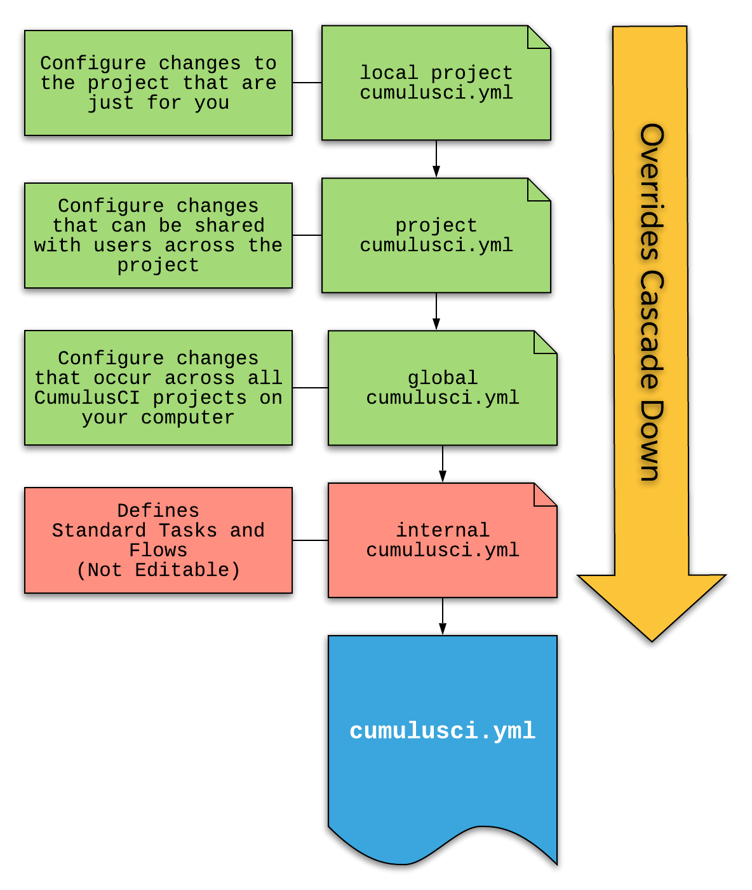

Configuring CumulusCI
=====================

``cumulusci.yml`` Structure
---------------------------
There are five top level sections of the ``cumulusci.yml`` file: Project, Tasks, Flows, Sources, and Orgs.

Project
*****************
The section is largely generated by running ``cci project init`` and has two major sub-categories: ``package``, and ``git``.
The ``package`` sub-section contains information about the projects package, while the ``git`` sub-section contains a link to the projects GitHub repository, and branch prefixes.

Tasks
*****************
This section lists any tasks that are currently being configured by your project.
Configurations here can include things like specifying default values for options or including a new custom task written in Python.

Flows
*****************
This section lists any flows that are currently being configured by your project.
Configuraitons here include things like, adding/removing/replacing steps in a flow, or defining new custom flows.

Sources
*****************
This section lists any GitHub repositories who's custom tasks and flows you would like to make available to CumulusCI.
You can find more on this topic in the `using tasks and flows from a different project`_ section.

Orgs
*****************
This section lists any customizations you've made to the five out-of-the-box org that come with CumulusCI or any net new orgs you've configured for your project.
The following is a an example where the default days for the ``dev`` org has been increased to 15, and there is a new org used for testing multicurrency.

.. code-block:: yaml

    orgs:
        dev:
            days: 15
        multicurrency:
            config_file: orgs/multicurrency.json
            days: 7

Plans
*****************
This section contains any custom plans you have defined for how to install your project into a customer org.
See more about plans on Metadeploy `here<TODO>`_

Common Configurations
---------------------
The following examples demonstrate the most common ways in which the ``cumulusci.yml`` file can be configured.

Setting Task Options
********************************
If there is a specific task that you run with static option values, you can instruct CumulusCI to always use specific value when running the task.
For example, if you want everyone in your project who runs the ``robot`` task, to execute the full suite of robot tests for your project, and always use the same output directory for results you could use:

.. code-block:: yaml

    robot:
        options:
            suites: robot/tests
            options:
                outputdir: robot/projectName/results

This assumes that robot tests for your project live under the ``robotframework/tests`` directory.
Now all users who work in this repository can run ``cci task run robot --org <org_name>`` and not have know anything about the options for the task!

Add a Custom Task
********************************
Say that you want to take the above example and create a custom task named ``robot_run_all`` to make it more apparent what this task is doing.

First, lookup the Python class associated with the standard task ``robot``. You can do this by going to the `internal CumulusCI file <https://github.com/SFDO-Tooling/CumulusCI/blob/master/cumulusci/cumulusci.yml>`_ and looking for the corresponding tasks `class value <https://github.com/SFDO-Tooling/CumulusCI/blob/d038f606d97f50a71ba1d2d6e9462a249b28864e/cumulusci/cumulusci.yml#L400>`_.

Now you can add the following under the ``tasks:`` section of your ``cumulusci.yml`` file, include the value we retrieved for ``class_path``.

.. code-block:: yaml

    robot_run_all:
        description: Runs all robot suites for the project
        class_path: cumulusci.tasks.robotframework.Robot
        group: projectName
        suites: robot/tests
        options:
            outputdir: robot/projectName/results

Congratulations! You have created a new custom task in CumulusCI!
Adding a common ``group`` attribute to your custom tasks makes it easy to see the tasks that are specific to your project with ``cci task list``.

This technique of renaming an existing standard task and providing it with a set of default option values is quite useful, and can be applied to many things.

If you have Salesforce reports that are part of your packages unpackaged Metadata that live under ``unpackaged/config/reports`` and our project's source code  is in `Metadata format <>`_  we could include the following in the ``tasks`` seciton of our project's ``cumulusci.yml`` file.

.. code-block::

    deploy_reports:
        description: Deploy reports
        class_path: cumulusci.tasks.salesforce.Deploy
        group: projectName
        options:
            path: unpackaged/config/reports
            namespace_inject: $project_config.project__package__namespace

Similarly, we can create a custom task that references the same that the `execute_anon task <https://github.com/SFDO-Tooling/CumulusCI/blob/d038f606d97f50a71ba1d2d6e9462a249b28864e/cumulusci/cumulusci.yml#L194>`_ uses to run a specific Apex method in your project's repository.

.. code-block:: yaml

    project_default_settings:
        description: Configure the default project settings
        class_path: cumulusci.tasks.apex.anon.AnonymousApexTask
        group: projectName
        options:
            path: scripts/configure_project_settings.cls
            apex: initializeProjectSettings();

The above assumes that the Apex file ``scripts/configure_project_settings.cls`` exists, and has a public static method named ``initializeProjectSettings``.

If you want to `write a custom task in python <TODO>`_ and make it available to other users in the project you would need to update your ``cumulusci.yml`` file's ``task`` section with the following:

.. code-block:: yaml

    tasks:
        my_new_task:
            description: Description of the task
            class_path: tasks.task_file.MyTaskClass
            group: projectName

The above assumes that your task's class is name ``MyTaskClass`` and exists in the file ``tasks/task_file.py``.

Add a Flow Step
********************************
If you want to add a step to a flow, you first need to know what the existing steps are.
The easiest way to see this is with ``cci flow info <flow_name>``.
Take the ``dev_org`` flow as an example:

.. code-block:: console

    $ cci flow info dev_org
    Description: Set up an org as a development environment for unmanaged metadata
    1) flow: dependencies [from current folder]
        1) task: update_dependencies
        2) task: deploy_pre
    2) flow: deploy_unmanaged
        0) task: dx_convert_from
        when: project_config.project__source_format == "sfdx" and not org_config.scratch
        1) task: unschedule_apex
        2) task: update_package_xml
        when: project_config.project__source_format != "sfdx" or not org_config.scratch
        3) task: deploy
        when: project_config.project__source_format != "sfdx" or not org_config.scratch
        3.1) task: dx_push
            when: project_config.project__source_format == "sfdx" and org_config.scratch
        4) task: uninstall_packaged_incremental
        when: project_config.project__source_format != "sfdx" or not org_config.scratch
    3) flow: config_dev
        1) task: deploy_post
        2) task: update_admin_profile
    4) task: snapshot_changes

There are four steps to this flow. The first three steps are themselves flows, and the last step is a task.

All *non-negative numbers and decimals* are valid as step numbers in a flow.
This makes it easy to add steps before, in-between, or after existing flow steps.
If we wanted to add a step at the beginning of the dev org flow, valid step numbers would include any number greater than or equal to zero and less than 1.
Example values would include: 0, 0.3, and 0.89334.
All of these would cause the step to execute before step 1 in the ``dev_org`` flow.

If you wanted to add a step between steps 2 and 3, then a step number of 2.5 could be utilized.

If you wanted to add a step number that runs after all steps in the flow, then any step number greater than 4 could be utilized.

Skip a Flow Step
********************************
To skip a flow step, set the desired step number to a task with the value of ``None``.
The following would skip the 4th step from the ``dev_org`` flow.

.. code-block:: yaml

    dev_org:
        steps:
            4:
                task: None

When CumulusCI detects a task with this value, it is skipped:

.. image:: images/skipping_task.png

Replace a Flow Step
********************************
To replace a flow step, simply name the task or flow you wish to run in place of the current step.
The following would replace the fourth step of the ``dev_org`` flow with a custom task that loads data into a dev environment.

.. code-block:: yaml

    dev_org:
        steps:
            4:
                task: load_data_dev

Add a Custom Flow
********************************
To define a new flow, simply add the name of the new flow under the ``flows`` section of your ``cumulusci.yml`` file.
Here is an example custom flow

.. code-block::
    my_project_flow:
        group: projectName
        description:
        steps:
            1:
                flow:
            2:
                task:

You can reference how we defined the flows for the standard library `here <https://github.com/SFDO-Tooling/CumulusCI/blob/d038f606d97f50a71ba1d2d6e9462a249b28864e/cumulusci/cumulusci.yml#L565>`_.

Configuration Scopes
--------------------
When we reference ``cumulusci.yml`` in our documentation, we are referring to the ``cumulusci.yml`` file located in your project's root directory.
In actuality, CumulusCI merges multiple `YAML <https://yaml.org/>`_ files that allow for configuration to occur at several distinct scopes.
All of these files are have the same name- ``cumulusci.yml`` -but live in different locations on the file system.

You can configure files at three scope levels: Project, Local Project, Global.
Configurations have the following order of precedence (from highest to lowest):

* Local Project
* Project
* Global

Overrides by precendence only happen when two configurations are attempting to set a value for the same element.
For example, say there exists a task T that takes two options o1 and o2.
You can specify a default value for o1 in your project's ``cumulusci.yml`` file and a default for o2 in your global ``cumulusci.yml`` file and everything will work as exepected.
If you then change your project's ``cumulusci.yml`` file to also specify a default value for o2, this will take precedence over the default value specified in your global ``cumulusci.yml`` file.

The following diagram illustrates these three files along with their corresponding scopes in green.
Changes made to configuration files on top will override any changes in files below them (if they are present).

Local Project Configurations
******************************
**File Path:** ``/path/to/project/cumulusci.yml``

Configurations made to this ``cumulusci.yml`` file apply to only the project with the given <project_name>.
If you want to make customizations to a project, but don't need them to be available to other team members, you would make those customizations here.
These configurations take precedence over **all other** configuration scopes.

Project Configurations
*************************
**File Path:** ``/path/to/project/cumulusci.yml``

This ``cumulusci.yml`` file lives in the root directory of your project and is typically included in source tracking.
It is useful to modify this file as the changes can be commited back to a remote repository so other team members can benefit from the customizations.
Configurations made to this file apply to this project, and take precedence over any configurations specified in the `global configurations`_ file, but are overwritten by configurations in the `local project`_ file.

Global Configurations
***********************
**File Path:** ``~/.cumulusci/cumulusci.yml``

Configuration of this file will override behavior across **all** CumulusCI projects on your machine.
Configurations in this file have the lowest precedence, and are overwritten by **all other** configuration scopes.

One Last ``cumulusci.yml``
*****************************
There is one more configuration file that exists; the `internal cumulusci.yml <https://github.com/SFDO-Tooling/CumulusCI/blob/master/cumulusci/cumulusci.yml>`_ file that ships with CumulusCI itself.
This file, contains all of the standard tasks, flows, and default configurations that come out of the box with CumulusCI.
You aren't able to modify it, but knowing about it serves two purposes:

* It is a fun bit of trivia to know that this file exists!
* It is useful to reference when working on configuring custom tasks or flows of your own.

Using Tasks and Flows From a Different Project
----------------------------------------------
The dependency handling discussed above is used in a very specific context, to install dependency packages or metadata bundles in the ``dependencies`` flow which is a component of some other flows.
It's also possible to use arbitrary tasks and flows from another project.
To do this, the other project must be named in the ``sources`` section of cumulusci.yml:

.. code-block:: yaml

    sources:
      npsp:
        github: https://github.com/SalesforceFoundation/NPSP

This says that when tasks or flows are referenced using the `npsp` namespace, CumulusCI should fetch the source from this GitHub repository.
By default, it will fetch the most recent release, or the default branch if there are no releases.
It's also possible to fetch a specific ``tag``:

.. code-block:: yaml

    sources:
      npsp:
        github: https://github.com/SalesforceFoundation/NPSP
        tag: rel/3.163

or a specific ``commit`` or ``branch``.

Now it's possible to run a flow from NPSP:

.. code-block:: console

    $ cci flow run npsp:install_prod

Or a task:

.. code-block:: console

    $ cci task run npsp:robot

Or even to create a new flow which uses a flow from NPSP:

.. code-block:: yaml

    flows:
      install_npsp:
        steps:
          1:
            flow: npsp:install_prod
          2:
            flow: dev_org

This flow will use NPSP's ``install_prod`` flow to install NPSP as a managed package, and then run this project's own ``dev_org`` flow.