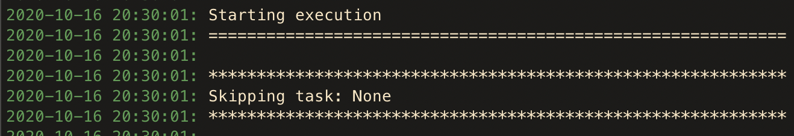

Configuring CumulusCI
=====================

CumulusCI merges multiple `YAML <https://yaml.org/>`_ files that allow for configuration to occur at several distinct scopes. All of these files have the same name, ``cumulusci.yml``, but live in different locations on the file system. (See `configuration scopes`_ for further detail.)

The `universal cumulusci.yml <https://github.com/SFDO-Tooling/CumulusCI/blob/master/cumulusci/cumulusci.yml>`_ file contains the default configuration stored within CumulusCI itself. This is the location of the standard library of tasks and flows that come with CumulusCI.

The project ``cumulusci.yml`` file is located in the ``project`` diretory. You can override aspects of the universal ``cumulusci.yml`` file here by defining project dependencies, configuring new tasks and flows, customizing standard tasks and flows to meet your project's needs, and so much more! 

    .. Important:: When ``cumulusci.yml`` is referenced in this documentation, it refers to the project ``cumulusci.yml`` file unless otherwise specified.

``cumulusci.yml`` Structure
---------------------------

There are six top-level sections of a ``cumulusci.yml`` file.

* ``project``: This section is largely generated by running ``cci project init``. It contains information pertaining to the project's package information (if any) and GitHub information.

* ``tasks``: This section defines the tasks that are available to run in your project. See `task configurations`_ for more info on the types of configurations that can be made in this section.

* ``flows``: This section defines the flows that are available to run in your project. See `flow configurations`_ for more info on the types of configurations that can be made in this section.

* ``sources``: This section references tasks and flows from another CumulusCI project on GitHub. See the `use tasks and flows from a different project`_ section for more information.

* ``orgs``: This section defines the scratch org configurations that are available for your project. See `scratch org configurations`_ for more information on the types of configurations that can be made in this section.

* ``plans``: This section contains any custom plans purposely defined to install your project into a customer org. For more information, see `configuring plans in MetaDeploy<TODO>`_.

A complete list of values that can be used in each section can be found in `cumulusci.yml reference<TODO>`_.

Task Configurations
-------------------

Task configurations are defined under the ``tasks`` section of your ``cumulusci.yml`` file. Each task configuration defines a task which can be run using the ``cci task run`` command, or included in a flow step. With a few simple changes to this section, you can configure build automation functionality without ever touching Python code.

Override a Task Option
^^^^^^^^^^^^^^^^^^^^^^^^

If you repeatedly  specify the same value for an option while running a task, you can configure CumulusCI to use that particular value as a default value.

     Example: Let's enforce a 90% code coverage requirement for Apex code in your project. The `run_tests<TODO>`_ task, which executes all Apex Tests in a target org, can enforce code coverage at a given percentage by passing the ``--required_org_code_coverage_percent`` option.

.. code-block:: yaml

    run_tests:
        options:
            required_org_code_coverage_percent: 90

When the code is placed under the ``tasks`` section of the ``cumulusci.yml`` file, CumulusCI overrides the default option with a value of ``90``. The overridden option is used whenever this automated task is called, unless it is further overridden for a particular flow step.

Verify the change by looking for a default option value when running ``cci task info <name>``.

.. code-block:: yaml

    $ cci task info run_tests
    run_tests

    Description: Runs all apex tests

    Class: cumulusci.tasks.apex.testrunner.RunApexTests

    Command Syntax

        $ cci task run run_tests

    Options
        .
        .
        .
      -o required_org_code_coverage_percent PERCENTAGE
        Optional
        Require at least X percent code coverage across the org following the test run.
        Default: 90

Add a Custom Task
^^^^^^^^^^^^^^^^^

To define a new task for your project, simply add the name of the new task under the ``tasks`` section of your ``cumulusci.yml`` file.

    Example: Let's create a custom task named ``deploy_reports`` that deploys a set of reports stored in your project's unpackaged metadata located in ``unpackaged/config/reports``.

    First, look up the Python class associated with the standard task ``deploy``. From there we can see that the ``deploy`` task has a ``class_path`` value of ``cumulusci.tasks.salesforce.Deploy``.

    Store the task under the ``tasks`` section of the ``cumulusci.yml`` file.

.. code-block:: yaml

    deploy_reports:
        description: Deploy Reports 
        class_path: cumulusci.tasks.salesforce.Deploy
        group: projectName
        options:
            path: unpackaged/config/reports

.. note:: Be sure to include the value we retrieved for ``class_path``. It's also best practice to add a common ``group`` attribute to your custom tasks in order to make it easier to see the tasks that are specific to your project when using ``cci task list``.

Congratulations! You created a new custom task in CumulusCI.

For additional examples of custom tasks, visit the `task recipes<TODO>`_ section in the cookbook.

If you want to `write a custom task in Python<TODO>`_ and make it available to other users in the project, add the task under the ``tasks`` section of the ``cumulusci.yml`` file:

.. code-block:: yaml

    tasks:
        my_new_task:
            description: Description of the task
            class_path: tasks.task_file.MyNewTaskClassName
            group: projectName

The above assumes that your task's class is named ``MyNewTaskClassName`` and exists in the file ``tasks/task_file.py``.

Use Variables for Task Options
^^^^^^^^^^^^^^^^^^^^^^^^^^^^^^^^

When you want to reference a specific value within the ``cumulusci.yml`` file, use the ``$project_config`` variable.

    Example: NPSP uses a variable for the project's namespace by setting a value of ``$project_config.project__package__namespace``. This variable is then referenced in the project's custom ``deploy_qa_config`` task where it passes as the value for the ``namespace_inject`` option.

    .. note:: A double underscore ( ``__`` ) allows access to different levels of the ``cumulusci.yml`` file.

.. code-block:: yaml

    deploy_qa_config:
            description: Deploys additional fields used for QA purposes only
            class_path: cumulusci.tasks.salesforce.Deploy
            group: Salesforce Metadata
            options:
                path: unpackaged/config/qa
                namespace_inject: $project_config.project__package__namespace

In this instance CumulusCI replaces the variable with the value currently located under project -> package -> namespace in the ``cumulusci.yml`` file. Here is the ``project`` section of NPSP's ``cumulusci.yml`` file:

.. code-block:: yaml

    project:
        name: Cumulus
        package:
            name: Cumulus
            name_managed: Nonprofit Success Pack
            namespace: npsp
            api_version: 48.0
            install_class: STG_InstallScript
            uninstall_class: STG_UninstallScript

Currently under ``$project_config.project__package__namespace`` is the value ``npsp``.

Reference Task Return Values
^^^^^^^^^^^^^^^^^^^^^^^^^^^^^^

Tasks can set an internal ``return_value`` on themselves while executing. This attribute allows one task in a flow to reference the ``return_value`` set on another task that executed prior to it.

To reference a return value on a previous task use the following:

.. code-block:: yaml

    ^^prior_task.return_value

To discover what's available for ``<return_value>``, find the source code for an individual task.

    Example: Let's examine how CumulusCI defines the standard ``upload_beta`` task in the universal ``cumulusci.yml`` file.

.. code-block:: yaml

    upload_beta:
            description: Uploads a beta release of the metadata currently in the packaging org
            class_path: cumulusci.tasks.salesforce.PackageUpload
            group: Release Operations

In order to see if anything is being set on ``self.return_values``, find the file where the class ``cumulusci.tasks.salesforce.PackageUpload`` is defined. A little digging yields that this class is defined in the file `package_upload.py<TODO>`_ and has a method called ``_set_return_values()``. `This method <https://github.com/SFDO-Tooling/CumulusCI/blob/3cad07ac1cecf438aaf087cdeff7b781a1fc74a1/cumulusci/tasks/salesforce/package_upload.py#L165>`_ sets ``self.return_values`` to a dictionary with the keys: ``version_number``, ``version_id``, and ``package_id``.

Now look at the standard ``release_beta`` flow defined in the universal ``cumulusci.yml`` file:

.. code-block:: yaml

   release_beta:
        description: Upload and release a beta version of the metadata currently in packaging
        steps:
            1:
                task: upload_beta
                options:
                    name: Automated beta release
            2:
                task: github_release
                options:
                    version: ^^upload_beta.version_number
            3:
                task: github_release_notes
                ignore_failure: True  # Attempt to generate release notes but don't fail build
                options:
                    link_pr: True
                    publish: True
                    tag: ^^github_release.tag_name
                    include_empty: True
                    version_id: ^^upload_beta.version_id
            4:
                task: github_master_to_feature

This flow shows how subsequent tasks can reference the return values of a prior task. In this case, the ``github_release`` task uses the ``version_numer`` set by the ``upload_beta`` task as an option value with the ``^^upload_beta.version_number`` syntax. Similarly, the ``github_release_notes`` task uses the ``version_id`` set by the ``upload_beta`` task as an option value with the ``^^upload_beta.version_id`` syntax.

Flow Configurations
-------------------

Flow configurations are defined under the ``flows`` section of your ``cumulusci.yml`` file. Each flow configuration defines a flow which can be run using the ``cci flow run`` command, or included in a flow step. With a few simple changes to this section, you can configure build automation functionality without ever touching Python code.

Add a Custom Flow
^^^^^^^^^^^^^^^^^

To define a new flow for your project, simply add the name of the new flow under the ``flows`` section of your ``cumulusci.yml`` file.

.. code-block:: yaml

    greet_and_sleep:
        group: projectName
        description: Greets the user and then sleeps for 5 seconds.
        steps:
            1:
                task: command
                options:
                    command: echo 'Hello there!' 
            2:
                task: util_sleep

This is a flow comprised of two tasks: ``command`` greets the user by echoing a string, and ``util_sleep`` then tells CumulusCI to sleep for five seconds. You can reference how the flows are defined in the `universal cumulusci.yml <https://github.com/SFDO-Tooling/CumulusCI/blob/master/cumulusci/cumulusci.yml>`_ file.

Add a Flow Step
^^^^^^^^^^^^^^^

If you want to add a step to a flow, use ``cci flow info <name>`` first to see the existing steps.

    Example: ``dev_org``

.. code-block:: console

    $ cci flow info dev_org
    Description: Set up an org as a development environment for unmanaged metadata
    1) flow: dependencies [from current folder]
        1) task: update_dependencies
        2) task: deploy_pre
    2) flow: deploy_unmanaged
        0) task: dx_convert_from
        when: project_config.project__source_format == "sfdx" and not org_config.scratch
        1) task: unschedule_apex
        2) task: update_package_xml
        when: project_config.project__source_format != "sfdx" or not org_config.scratch
        3) task: deploy
        when: project_config.project__source_format != "sfdx" or not org_config.scratch
        3.1) task: dx_push
            when: project_config.project__source_format == "sfdx" and org_config.scratch
        4) task: uninstall_packaged_incremental
        when: project_config.project__source_format != "sfdx" or not org_config.scratch
    3) flow: config_dev
        1) task: deploy_post
        2) task: update_admin_profile
    4) task: snapshot_changes

There are four steps to this flow. The first three steps are themselves flows, and the last step is a task.

All *non-negative numbers and decimals* are valid as step numbers in a flow.
You can add steps before, in-between, or after existing flow steps.
If you want to add a step at the beginning of the dev org flow, valid step numbers would include any number greater than or equal to zero and less than 1. Example values would include 0, 0.3, and 0.89334. All of these would cause the step to execute before step 1 in the ``dev_org`` flow.

If you want to add a step *between* steps 2 and 3, then a step number greater than 2 or less than 3 can be used.

If you want to add a step *after* all steps in the flow, then any step number greater than 4 can be used.

You can also add an additional log line output during the execution of a flow.

    Example: ``dev_org``

.. code-block:: yaml

    dev_org:
        steps:
            5:
                task: log
                    options:
                        line: dev_org flow has completed

Skip a Flow Step
^^^^^^^^^^^^^^^^

To skip a flow step, set the desired step number to a task or flow with the value of ``None``.

    Example: To skip the fourth step of the ``dev_org`` flow, insert the following under the ``flows`` section of your ``cumulusci.yml`` file.

.. code-block:: yaml

    dev_org:
        steps:
            4:
                task: None

.. note::
    The value of ``task`` must be used when skipping a flow step that is a task. The value of ``flow`` must be used when skipping a flow step that corresponds to a flow.

When CumulusCI detects a task with a value of ``None``, the task is skipped.

Replace a Flow Step
^^^^^^^^^^^^^^^^^^^

To replace a flow step, simply name the task or flow you wish to run in place of the current step.

    Example: To replace the default fourth step of the ``dev_org`` flow with a custom task that loads data into a dev environment, specify the custom task you want to use in that step.

.. code-block:: yaml

    dev_org:
        steps:
            4:
                task: load_data_dev

___

    Or to replace the existing task with a flow as the fourth step of the ``dev_org`` flow, first set the task to ``None`` and then insert the new flow.

.. code-block:: yaml

    dev_org:
        steps:
            4:
                task: None
                flow: my_flow

You can swap two steps in a flow by replacing one with the other. If the steps are of different types (task/flow), the types being replaced first need to be set to ``None``.

Configure Options on Tasks When Running a Subflow
^^^^^^^^^^^^^^^^^^^^^^^^^^^^^^^^^^^^^^^^^^^^^^^^^^^

Specify options on tasks in subflows with the following syntax:

.. code-block:: yaml

    <flow_to_modify>:
        steps:
            <step_number>:
                ``flow``: ``<sub_flow_name>``
                options:
                    ``<task>``:
                        ``<option_name>``: ``<value>``

Replace all values with ``<>`` with the desired values.

    Example: Let's examine the definition of the ``ci_master`` flow from the universal ``cumulusci.yml`` file:

.. code-block::

    ci_master:
        group: Continuous Integration
        description: Deploy the package metadata to the packaging org and prepare for managed package version upload.  Intended for use against main branch commits.
        steps:
            1:
                flow: dependencies
                options:
                    update_dependencies:
                        include_beta: False
            2:
                flow: deploy_packaging
            3:
                flow: config_packaging

This flow specifies that when the subflow ``dependencies`` runs, the ``include_beta`` option is passed a value of ``False`` to the ``update_dependencies`` task (which itself executes in the ``dependencies`` subflow). 

``when`` Clauses
^^^^^^^^^^^^^^^^^^^^^^

Specify a ``when`` clause in a flow step to conditionally run that step. A ``when`` clause is written in a Pythonic syntax that can evaluate to a boolean (``True`` or ``False``) result. 

The variables that are available for reference in ``when`` clauses [TO BE ADDED]

A common use case is to be able to check [TO BE ADDED]

See `use variables for task options`_ for more information.

Scratch Org Configurations
--------------------------

This section defines the scratch org configurations that are available without explicitly running ``cci org scratch`` to create a new configuration. If you're looking for more information on the use of scratch orgs with CumulusCI, see `Scratch Org Environments<TODO>`_. 

Override Default Values
^^^^^^^^^^^^^^^^^^^^^^^

.. note:: These overrides pertain only to scratch orgs.

You can override these values for your org:

* ``days`` (integer): Number of days for the scratch org to persist.
* ``namespaced`` (boolean): Whether or not the scratch org is a `namespaced org<TODO sf link?>`_.
* ``config_file`` (string): Path to the org definition file to use when building the scratch org.

.. code-block:: yaml
    
    orgs:
        scratch:
            ``<org_name>``:
                ``<key>``: ``<value>``

Replace all values with <> with the desired values.

    Example: Override the default number of days from 7 to 15 on the ``dev`` org.

.. code-block:: yaml

    orgs:
        dev:
            days: 15

Configuration Scopes
--------------------

You can configure files at three scope levels: *Project*, *Local Project* and *Global*. Configurations have an order of override precedence (from highest to lowest):

#. Project
#. Local Project
#. Global

One override only cascades over another when two configurations set a value for the same element on a task or flow.

    Example: Task ``T`` takes two options, ``o1`` and ``o2``.

    You can specify a default value for ``o1`` in your project ``cumulusci.yml`` file and a default value for ``o2`` in your global ``cumulusci.yml`` file, and you'll see the expected result: both values are available in the project. (The default of ``o1`` is not exposed to other projects.)

    If you change your project ``cumulusci.yml`` file to also specify a default value for ``o2``, this new default ``o2`` value takes precedence over the default ``o2`` value specified in your global ``cumulusci.yml`` file.

Project Configurations
^^^^^^^^^^^^^^^^^^^^^^

**macOS/Linux:** ``.../path/to/project/cumulusci.yml``

**Windows:** ``...\path\to\project\cumulusci.yml``

This ``cumulusci.yml`` file lives in the ``project`` directory and applies solely to this project. Changes here are committed back to a remote repository so other team members can benefit from the customizations. Configurations in this file apply solely to this project, and take precedence over any configurations specified in the global ``cumulusci.yml`` file, but are overridden by configurations in the local project ``cumulusci.yml`` file.

Local Project Configurations
^^^^^^^^^^^^^^^^^^^^^^^^^^^^

**macOS/Linux:** ``~/.cumulusci/project_name/cumulusci.yml``

**Windows:** ``%homepath%\.cumulusci\project_name\cumulusci.yml``

Configurations made to this ``cumulusci.yml`` file apply solely to the project with the given <project_name>, and take precedence over **all other** configuration scopes except the universal ``cumulusci.yml`` file. If you want to make customizations to a project, but don't need them to be available to other team members, make those customizations here.

Global Configurations
^^^^^^^^^^^^^^^^^^^^^

**macOS/Linux:** ``~/.cumulusci/cumulusci.yml``

**Windows:** ``%homepath%\.cumulusci\cumulusci.yml``

Configuration of this file overrides behavior across **all** CumulusCI projects on your machine. Configurations in this file have a low precedence, and are overridden by **all other** configurations except for those that are in the universal ``cumulusci.yml`` file.

Universal Configurations
^^^^^^^^^^^^^^^^^^^^^^^^

There is one more configuration file that exists: the `universal cumulusci.yml <https://github.com/SFDO-Tooling/CumulusCI/blob/master/cumulusci/cumulusci.yml>`_ file that ships with CumulusCI itself. This file actually holds the lowest precedence of all, as all other scopes override what is contained in this file. That said, it contains all of the definitions for the standard tasks, flows, and org configurations that come standard with CumulusCI.

The commands ``cci task info`` and ``cci flow info`` display all of the infomation regarding how a particular task or flow is configured. They display both the information present in the standard library alongside any customizations that have been added.

Advanced Configurations
-----------------------

Use Tasks and Flows From a Different Project
^^^^^^^^^^^^^^^^^^^^^^^^^^^^^^^^^^^^^^^^^^^^^^
It's also possible to use tasks and flows from another project with CumulusCI. To do this, the other project must be named under the ``sources`` section of the project ``cumulusci.yml`` file:

    Example: When tasks or flows are referenced using the `npsp` namespace, CumulusCI fetches the source from the NPSP GitHub repository.

.. code-block:: yaml

    sources:
      npsp:
        github: https://github.com/SalesforceFoundation/NPSP

By default, CumulusCI fetches the most recent release, or the default branch if there are no releases.

.. note::
    In order for this feature to work, the referenced repository needs to be readable (for example, it's public, or CumulusCI's GitHub service is configured with the token of a user who has read access to it).

It's also possible to fetch a specific ``tag``:

.. code-block:: yaml

    sources:
      npsp:
        github: https://github.com/SalesforceFoundation/NPSP
        tag: rel/3.163

or a specific ``commit`` or ``branch``.

When the repo is listed under ``sources``, it's possible to run a flow from NPSP:

.. code-block:: console

    $ cci flow run npsp:install_prod

Or a task:

.. code-block:: console

    $ cci task run npsp:robot

Or even create a new flow that uses a flow from NPSP:

.. code-block:: yaml

    flows:
      install_npsp:
        steps:
          1:
            flow: npsp:install_prod
          2:
            flow: dev_org

This flow uses NPSP's ``install_prod`` flow to install NPSP as a managed package, and then run this project's own ``dev_org`` flow.

Troubleshooting Configurations
------------------------------

Use ``cci task info <name>`` and ``cci flow info <name>`` to see how a given task or flow behaves with the current state of configuration.

    Example: The ``util_sleep`` task has a ``seconds`` option with a default value of 5 seconds.

.. code-block:: console

    $ cci task info util_sleep
    util_sleep

    Description: Sleeps for N seconds

    Class: cumulusci.tasks.util.Sleep

    Command Syntax

        $ cci task run util_sleep

    Options

        -o seconds SECONDS
        Required
        The number of seconds to sleep
        Default: 5

If you want to change the default value to 30 seconds for all projects, add the desired value in your global ``cumulusci.yml`` file located at ``~/.cumulusci/cumulusci.yml``:

.. code-block:: yaml

    tasks:
        util_sleep:
            options:
                seconds: 30

Now ``cci task info util_sleep`` shows a default of 30 seconds.

.. code-block:: console

    $ cci task info util_sleep
    util_sleep

    Description: Sleeps for N seconds

    Class: cumulusci.tasks.util.Sleep

    Command Syntax

        $ cci task run util_sleep

    Options

        -o seconds SECONDS
        Required
        The number of seconds to sleep
        Default: 30

Being able to display the active configuration for a given task or flow can help with cross-correlating which configuration scope affects a specific scenario.