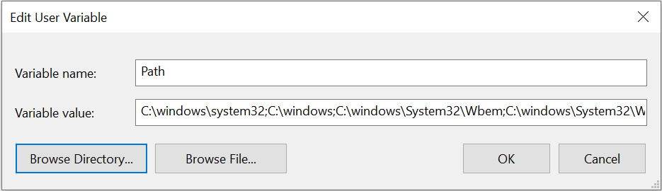

Get Started
===========

.. contents::
    :depth: 2
    :local:

Install CumulusCI
-----------------

.. note:: These installation instructions assume some familiarity with entering commands into a terminal.
    If that's completely new to you, we recommend visiting the `CumulusCI Setup module <https://trailhead.salesforce.com/content/learn/modules/cumulusci-setup>`_ on Trailhead for a step by step walkthrough.

On macOS
^^^^^^^^

`Homebrew <https://brew.sh/>`_ is a prerequisite for installing CumulusCI on macOS. Start there.

Install via ``pipx``
********************

``pipx`` ensures that CumulusCI and its dependencies are installed into their own Python environment separate from other Python software on your computer. **We cannot recommend it enough!**

First, install ``pipx`` with the following commands::

    $ brew install pipx
    $ pipx ensurepath

After ``pipx`` installs, install CumulusCI::

    $ pipx install cumulusci

Once finished `verify your installation`_.

On Linux
^^^^^^^^

Install via ``pipx``
********************

``pipx`` ensures that CumulusCI and its dependencies are installed into their own Python environment separate from other Python software on your computer. **We cannot recommend it enough!**

Installation instructions for ``pipx`` can be found `here <https://pipxproject.github.io/pipx/installation/>`_.

After ``pipx`` installs, install CumulusCI::

    $ pipx install cumulusci

Once finished `verify your installation`_.

On Windows
^^^^^^^^^^

Install Python 3
********************

#. Go to the `Python downloads page <https://www.python.org/downloads/release/python-383/>`_.
#. Download the latest Python 3 release. Most users should select the "Download Windows x86-64 executable installer" link for the most recent stable release, but it may depend on your particular computer setup.
#. Use the installation wizard to install:

   * Check the "Add Python <version> to PATH" checkbox.
   * Click "Install Now".

.. image:: images/windows_python.png

Install via ``pipx``
********************

``pipx`` ensures that CumulusCI and its dependencies are installed into their own Python environment separate from other Python software on your computer. **We cannot recommend it enough!**

Open your preferred terminal application (e.g. `CMD.exe <https://docs.microsoft.com/en-us/windows-server/administration/windows-commands/cmd>`_ on Windows).
If you already have your terminal open, close it and reopen it. Enter the following command::

    $ python -m pip install --user pipx

.. image:: images/pipx.png

To permanently modify the default environment variables:

1. Click Start and search for "edit environment variables", or open System properties and click Advanced system settings.
2. Click the Environment Variables button.
3. To change System variables, you need non-restricted access to your machine (i.e. Administrator rights). Add the following paths to your PATH environment variable:

   * ``%USERPROFILE%\.local\bin``
   * ``%USERPROFILE%\AppData\Roaming\Python\Python38\Scripts``

.. note::  Be precise when entering these paths. Add them at the very end of the Variable Value already in place. Separate each path by a semicolon (;) with no space between path names.

Open a new command prompt and verify that ``pipx`` is available::

    pipx --version

You should see a version number after entering this command, such as: ``0.12.3.1``.

If you get an error instead, such as ``'pipx' is not recognized as an internal or external command,
operable program or batch file.``, confirm that your environment variables have been updated.

Finally, install CumulusCI:

Inside your terminal application, enter the following command::

    pipx install cumulusci

Once finished `verify your installation`_.

Verify Your Installation
^^^^^^^^^^^^^^^^^^^^^^^^

In a new terminal window, verify that CumulusCI installed correctly by running ``cci version``.

.. code-block:: console

    $ cci version
    CumulusCI version: 3.20.0 (/path/to/bin/cci)
    Python version: 3.8.5 (/path/to/bin/python)

    You have the latest version of CumulusCI.

You can also use this command to check whether your CumulusCI installation is up to date.

Still need help? Feel free to submit a question on our `Trailblazer community group <https://trailblazers.salesforce.com/_ui/core/chatter/groups/GroupProfilePage?g=0F9300000009M9ZCAU>`_.

Setup SFDX 
----------

While it's possible to use ``cci org connect <org_name>`` to connect to a persistent org, we recommend working with scratch orgs created by Salesforce DX.

If you haven't set up Salesforce DX, follow these steps:

1. `Install Salesforce CLI <https://developer.salesforce.com/docs/atlas.en-us.sfdx_setup.meta/sfdx_setup/sfdx_setup_install_cli.htm>`_
2. `Enable Dev Hub Features in Your Org <https://developer.salesforce.com/docs/atlas.en-us.228.0.sfdx_dev.meta/sfdx_dev/sfdx_setup_enable_devhub.htm>`_
3. `Connect SFDX to Your Dev Hub Org <https://developer.salesforce.com/docs/atlas.en-us.sfdx_dev.meta/sfdx_dev/sfdx_dev_auth_web_flow.htm>`_ 
        .. important:: Be sure to use the ``--setdefaultdevhubusername`` option!

If you have the ``sfdx`` command installed, are connected to your devhub, and set the ``defaultdevhubusername`` config setting (use the ``sfdx force:config:list`` command to verify!), you're now ready to use ``cci`` with ``sfdx``.

SFDX supports multiple DevHubs, so CumulusCI uses the one set as ``defaultdevhubusername`` when creating scratch orgs.

Learn more about Salesforce DX at https://developer.salesforce.com/platform/dx.

Connect to GitHub
-----------------

In order to allow CumlusCI to work with your CumulusCI projects in GitHub, connect GitHub as a service in ``cci``.

First, `create a new personal access token <https://github.com/settings/tokens/new>`_ with both "repo" and "gist" scopes specified. (Scopes appear as checkboxes when creating the personal access token in GitHub.) Copy the access token to use as the password when configuring the GitHub service.

[ EXAMPLE PHOTO OF ACCESS TOKEN TO COPY??? ]

Next, run the following command and provide your GitHub username and access token as the password::

    $ cci service connect github

Verify the GitHub service is connected by running ``cci service list``:

Once you've configured the ``github`` service it will be available to **all** CumulusCI projects.

Services are stored in the global CumulusCI keychain by default.

Work on an Existing CumulusCI Project
-------------------------------------

Follow this section if there's an existing CumulusCI project on GitHub that you'd like to work on.

.. note:: CumulusCI does not support projects stored on other Git hosts such as BitBucket or GitLab at this time.

There are three preliminary steps for working on an existing CumulusCI project. You need to:

* `Install CumulusCI`_
* `Install Git <https://git-scm.com/book/en/v2/Getting-Started-Installing-Git>`_
* `Clone the Project's GitHub Repository <https://docs.github.com/en/free-pro-team@latest/desktop/contributing-and-collaborating-using-github-desktop/adding-and-cloning-repositories>`_

You can change directories into the project's root directory and begin executing ``cci`` commands. For example, ``cci project info`` displays information about the project:

.. code-block:: console

    $ cd cumulusci-test

    $ cci project info
    name: CumulusCI Test
    package:
        name: CumulusCI Test
        name_managed: None
        namespace: ccitest
        install_class: None
        uninstall_class: None
        api_version: 33.0
    git:
        default_branch: main
        prefix_feature: feature/
        prefix_beta: beta/
        prefix_release: release/
        release_notes:
            parsers:
                1:
                    class_path: cumulusci.tasks.release_notes.parser.GithubLinesParser
                    title: Critical Changes
                2:
                    class_path: cumulusci.tasks.release_notes.parser.GithubLinesParser
                    title: Changes
                3:
                    class_path: cumulusci.tasks.release_notes.parser.GithubIssuesParser
                    title: Issues Closed
                4:
                    class_path: cumulusci.tasks.release_notes.parser.GithubLinesParser
                    title: New Metadata
                5:
                    class_path: cumulusci.tasks.release_notes.parser.GithubLinesParser
                    title: Deleted Metadata
        repo_url: https://github.com/SFDO-Tooling/CumulusCI-Test
    test:
        name_match: %_TEST%

Starting a New CumulusCI Project
--------------------------------

There are three preliminary steps for starting a brand new CumulusCI project. You need to:

#. `Install CumulusCI`_
#. `Install Git <https://git-scm.com/book/en/v2/Getting-Started-Installing-Git>`_
#. `Install the Salesforce CLI <https://developer.salesforce.com/tools/sfdxcli>`_

First, make a directory with your project's name, navigate into the directory, and initialize it as a Git repository.

.. code-block:: console

    $ mkdir cci_project
    $ cd cci_project
    $ git init

Next, initialize the project as a CumulusCI project.

Project Initialization
^^^^^^^^^^^^^^^^^^^^^^

Use the ``cci project init`` command within a Git repository to generate the initial version of a project's ``cumulusci.yml`` file. CumulusCI creates a customized ``cumulusci.yml`` file by first asking questions about your project.

+------------------------------------------------------------------+-------------------------------------------------------------------------------------------------------------------------------------------------------------------------------------------------------------------------------------------------------------------------------------------------------+
|                              Prompt                              |                                                                                                                                             What's it for?                                                                                                                                            |
+------------------------------------------------------------------+-------------------------------------------------------------------------------------------------------------------------------------------------------------------------------------------------------------------------------------------------------------------------------------------------------+
| Project Info                                                     | The name is usually the same as your repository name.                                                                                                                                                                                                                                                 |
|                                                                  | NOTE: Do **not** use spaces in the project name.                                                                                                                                                                                                                                                      |
+------------------------------------------------------------------+-------------------------------------------------------------------------------------------------------------------------------------------------------------------------------------------------------------------------------------------------------------------------------------------------------+
| Package Name                                                     | CumulusCI uses an unmanaged package as a container for your project's metadata.                                                                                                                                                                                                                       |
|                                                                  | Enter the name of the package you want to use.                                                                                                                                                                                                                                                        |
+------------------------------------------------------------------+-------------------------------------------------------------------------------------------------------------------------------------------------------------------------------------------------------------------------------------------------------------------------------------------------------+
| Is this a managed package project?                               | Yes, if this project is a managed package.                                                                                                                                                                                                                                                            |
+------------------------------------------------------------------+-------------------------------------------------------------------------------------------------------------------------------------------------------------------------------------------------------------------------------------------------------------------------------------------------------+
| Salesforce API Version                                           | Which Salesforce API version does your project use? Defaults to the latest.                                                                                                                                                                                                                           |
+------------------------------------------------------------------+-------------------------------------------------------------------------------------------------------------------------------------------------------------------------------------------------------------------------------------------------------------------------------------------------------+
| Which source format do you want to use? [sfdx | mdapi]           | DX source format (aka "SFDX Format") stores data under the ``force-app`` directory.                                                                                                                                                                                                                   |
|                                                                  | Metadata API format is the "older" format and stores data under the ``src`` directory.                                                                                                                                                                                                                |
+------------------------------------------------------------------+-------------------------------------------------------------------------------------------------------------------------------------------------------------------------------------------------------------------------------------------------------------------------------------------------------+
| Are you extending another CumulusCI project such as NPSP or EDA? | CumulusCI makes it easy to build extensions of other projects configured for CumulusCI like Salesforce.org's NPSP and EDA.  If you are building an extension of another project using CumulusCI and have access to its GitHub repository, use this section to configure this project as an extension. |
+------------------------------------------------------------------+-------------------------------------------------------------------------------------------------------------------------------------------------------------------------------------------------------------------------------------------------------------------------------------------------------+
| Default Branch                                                   | Your project's main/master branch in GitHub. Defaults to the branch that is currently checked out in your local repository.                                                                                                                                                                           |
+------------------------------------------------------------------+-------------------------------------------------------------------------------------------------------------------------------------------------------------------------------------------------------------------------------------------------------------------------------------------------------+
| Feature Branch Prefix                                            | Your project's feature branch prefix (if any). Defaults to ``feature``.                                                                                                                                                                                                                               |
+------------------------------------------------------------------+-------------------------------------------------------------------------------------------------------------------------------------------------------------------------------------------------------------------------------------------------------------------------------------------------------+
| Beta Tag Prefix                                                  | Your project's beta branch prefix (if any). Defaults to ``beta``.                                                                                                                                                                                                                                     |
+------------------------------------------------------------------+-------------------------------------------------------------------------------------------------------------------------------------------------------------------------------------------------------------------------------------------------------------------------------------------------------+
| Release Tag Prefix                                               | Your project's release branch prefix (if any). Defaults to ``release``.                                                                                                                                                                                                                               |
+------------------------------------------------------------------+-------------------------------------------------------------------------------------------------------------------------------------------------------------------------------------------------------------------------------------------------------------------------------------------------------+
| Test Name Match                                                  | The CumulusCI Apex test runner uses a SOQL ``WHERE`` clause to select which tests to run.  Enter the SOQL pattern to match test class names.                                                                                                                                                          |
+------------------------------------------------------------------+-------------------------------------------------------------------------------------------------------------------------------------------------------------------------------------------------------------------------------------------------------------------------------------------------------+
| Do you want to check Apex code coverage when tests are run?      | If yes, checks Apex code coverage when tests are run.                                                                                                                                                                                                                                                 |
+------------------------------------------------------------------+-------------------------------------------------------------------------------------------------------------------------------------------------------------------------------------------------------------------------------------------------------------------------------------------------------+
| Minimum code coverage percentage                                 | Sets the minimum allowed code coverage percentage for your project.                                                                                                                                                                                                                                   |
+------------------------------------------------------------------+-------------------------------------------------------------------------------------------------------------------------------------------------------------------------------------------------------------------------------------------------------------------------------------------------------+

Verify Project Initialization
^^^^^^^^^^^^^^^^^^^^^^^^^^^^^

Verify project initialization was successful by verifying that ``cumulusci.yml`` exists and has contents.

.. code-block:: console

    $ cat cumulusci.yml
    project:
        name: SampleProjectName
        package:
            name: SamplePackageName
            namespace: sampleNamespace
        .
        .
        .

The ``cumulusci.yml`` file configures your project-specific tasks, flows, and customizations.

For more information regarding configuration, check out our `project configuration <#TODO internal ref here>`_ section of the docs.
You can even add and commit it to your Git repository:

.. code-block:: console

    $ git add cumulusci.yml
    $ git commit -m "Initialized CumulusCI Configuration"

Add Your Repo to GitHub
^^^^^^^^^^^^^^^^^^^^^^^

With your ``cumulusci.yml`` file committed, create a repository on GitHub for your new project and push your changes there.
There are multiple ways to do this:

* Our `Community Project Development with CumulusCI <https://trailhead.salesforce.com/content/learn/modules/community-project-development-with-cumulusci?trail_id=build-applications-with-cumulusci>`_ module covers GitHub Desktop in the "Set Up the Project" section.
* If you prefer the command line, GitHub has excellent guides on both `git remote <https://github.com/git-guides/git-remote>`_ and `git push <https://github.com/git-guides/git-push>`_.

Convert an Existing Salesforce Project
--------------------------------------

Converting an existing Salesforce project to use CumulusCI may follow a number of different paths, depending on whether you're practicing the Org Development Model or the Package Development Model; whether or not you're already developing in scratch orgs; and the complexity of your project's dependencies on the org environment.

If you're developing in persistent orgs and not already using source control, you'll also need to retrieve the existing metadata from the org. Note that adopting source control and moving from persistent orgs into scratch orgs are case-specific processes; your experience may vary and you may need to undertake additional work as part of those transitions.

You're welcome to discuss project conversion in the `CumulusCI (CCI) Trailblazer group <https://trailblazers.salesforce.com/_ui/core/chatter/groups/GroupProfilePage?g=0F9300000009M9Z>`_.

Project Setup
^^^^^^^^^^^^^

Prior to retrieving your project's metadata you need to set up the project's root directory. These steps include:

* Creating a project directory and initializing it as a Git repository as outlined in `starting a new CumulusCI project`_.
* Initializing the directory as a CumulusCI project as outlined in `project initialization`_.

Retrieving Metadata
^^^^^^^^^^^^^^^^^^^

The following assumes that your project currently lives in a persistent org, such as a Developer Edition org or a sandbox. We recommend retrieving metadata via the Metadata API (using the Salesforce CLI), followed by converting the source from Metadata API to SFDX format.

#. If the metadata you want to retrieve isn't already in a package, `create one <https://help.salesforce.com/articleView?id=creating_packages.htm>`_.
    .. note:: If your project contains a managed package, ensure that the package namespace matches the namespace you entered when running ``cci project init``.

#. Run the `retrieve command <https://developer.salesforce.com/docs/atlas.en-us.sfdx_cli_reference.meta/sfdx_cli_reference/cli_reference_force_mdapi.htm#cli_reference_retrieve>`_ to extract your package metadata::

    $ sfdx force:source:retrieve -n package_name /path/to/project/

That's it! You now have all of the metadata you care about in a single Git repository configured for use with CumulusCI.
At this point you may want to `add your repo to GitHub`_, or perhaps begin `configuring CumulusCI` <#TODO doc ref>.

Org Shape Setup
^^^^^^^^^^^^^^^

TODO: link to org section

Other Conversion Considerations
^^^^^^^^^^^^^^^^^^^^^^^^^^^^^^^

* If you or your team have been working with `scratch org definition files <https://developer.salesforce.com/docs/atlas.en-us.sfdx_dev.meta/sfdx_dev/sfdx_dev_scratch_orgs_def_file.htm>`_ for use with ``sfdx``, consult our documentation on `configuring orgs` <#TODO doc ref> to utilize them with CumulusCI.
* If you have metadata that you would like deployed pre or post deployment, `#TODO <pre/post ref>`.
* If you have data that you need to include for testing or production purposes, visit our section on `Automating Data Operations` <#TODO doc ref>.
