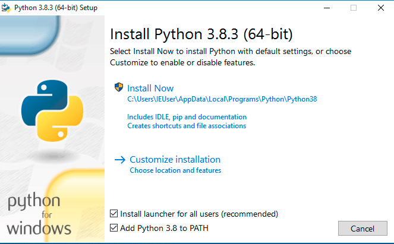

Get Started
===========

.. contents:: 
    :depth: 2
    :local:

Install CumulusCI
-----------------

.. note:: These installation instructions assume some familiarity with entering commands into a terminal.
    If that's completely new to you, we recommend starting with the `CumulusCI setup module <https://trailhead.salesforce.com/content/learn/modules/cumulusci-setup>`_ module on Trailhead to walk you through step by step.

On macOS 
^^^^^^^^
Ensure you have `Homebrew <https://brew.sh/>`_ installed as it is a prerequisite for installing CumulusCI on macOS.

Install via ``pipx`` 
******************************
We recommend installing CumulusCI using ``pipx``, which will make sure that CumulusCI and its dependencies are installed into their own Python environment that is separate from other Python software on your computer.
First install ``pipx`` with the following two commands::

    $ brew install pipx
    $ pipx ensurepath

Once ``pipx`` is installed, you can install CumulusCI::

    $ pipx install cumulusci

Once finished you can `verify your installation`_.

On Linux
^^^^^^^^

Install via ``pipx``
**************************
We recommend installing CumulusCI using ``pipx``, which will make sure that CumulusCI and its dependencies are installed into their own Python environment that is separate from other Python software on your computer.
Installation instruction for ``pipx`` can be found `here <https://pipxproject.github.io/pipx/installation/>`_.
Once ``pipx`` is installed, we can install CumulusCI::

    $ pipx install cumulusci

Once finished you can `verify your installation`_.

On Windows
^^^^^^^^^^

Install Python 3
********************
#. Go to the `Python downloads page <https://www.python.org/downloads/release/python-383/>`_. 
#. Download the latest Python 3 release. Most users should select the "Download Windows x86-64 executable installer" link for the most recent stable release, but it may depend on your particular computer setup.
#. Use the installation wizard to install:

   * Check the "Add Python <version> to PATH" checkbox
   * Click "Install Now"

Install via ``pipx``
***********************
We recommend installing CumulusCI using ``pipx``, which will make sure that CumulusCI and its dependencies are installed into their own Python environment that is separate from other Python software on your computer.
Open your preferred terminal application
(e.g. `CMD.exe <https://docs.microsoft.com/en-us/windows-server/administration/windows-commands/cmd>`_ on Windows).
If you already have your terminal open, close it and reopen it. Enter the following command::

    $ python -m pip install --user pipx

.. image:: images/pipx.png

Next we want to modify the default PATH environment variable to include pipx::

    $ python -m pipx ensurepath 

Open a new command prompt and verify that pipx is available::

    $ pipx --version

You should see a version number after entering in this command, such as: ``0.15.5.1``.

You can now install CumulusCI with::

    $ pipx install cumulusci

Now `verify your installation`_.

Verify Your Installation
^^^^^^^^^^^^^^^^^^^^^^^^

In a new terminal window, you can verify that CumulusCI is installed correctly by running ``cci version``:

.. code-block:: console

    $ cci version
    CumulusCI version: 3.20.0 (/path/to/bin/cci)
    Python version: 3.8.5 (/path/to/bin/python)

    You have the latest version of CumulusCI.

You can also use this command in the future to check whether your CumulusCI installation is up to date.

Still need help? Feel free to ask a question on our `Trailblazer community group <https://trailblazers.salesforce.com/_ui/core/chatter/groups/GroupProfilePage?g=0F9300000009M9ZCAU>`_.

Connect to GitHub
-----------------
In order to allow CumlusCI to work with your CumulusCI projects in GitHub, you need to connect GitHub as a service in ``cci``.

First, `create a new personal access token <https://github.com/settings/tokens/new>`_ with both "repo" and "gist" scopes specified.
(Scopes appear as checkboxes when creating the personal access token in GitHub).
Copy the access token to use as the password when configuring the GitHub service.

Next, run the following command and provide your GitHub username and the access token as the password::

    $ cci service connect github

You can verify the GitHub service is connected by running ``cci service list``:

.. image:: images/service-list.png

Once you've configured the ``github`` service it will be available to **all** CumulusCI projects.
Services are stored in the global CumulusCI keychain by default.

Work on an Existing CumulusCI Project
-------------------------------------
Use this section if there is an existing CumulusCI project on GitHub that you'd like to work on.
Note: CumulusCI does not support projects stored on other Git hosts such as BitBucket or GitLab at this time.
There are three preliminary steps for working on an existing CumulusCI project you need to:

* `Install CumulusCI`_
* `Install Git <https://git-scm.com/book/en/v2/Getting-Started-Installing-Git>`_
* `Clone the Project's GitHub Repository <https://docs.github.com/en/free-pro-team@latest/desktop/contributing-and-collaborating-using-github-desktop/adding-and-cloning-repositories>`_

You can now change directories into the project's root directory and begin executing ``cci`` commands.
For example, ``cci project info`` can be run to display information about the project:

.. code-block:: console

    $ cd cumulusci-test

    $ cci project info
    name: CumulusCI Test
    package:
        name: CumulusCI Test
        name_managed: None
        namespace: ccitest
        install_class: None
        uninstall_class: None
        api_version: 33.0
    git:
        default_branch: main
        prefix_feature: feature/
        prefix_beta: beta/
        prefix_release: release/
        release_notes:
            parsers:
                1:
                    class_path: cumulusci.tasks.release_notes.parser.GithubLinesParser
                    title: Critical Changes
                2:
                    class_path: cumulusci.tasks.release_notes.parser.GithubLinesParser
                    title: Changes
                3:
                    class_path: cumulusci.tasks.release_notes.parser.GithubIssuesParser
                    title: Issues Closed
                4:
                    class_path: cumulusci.tasks.release_notes.parser.GithubLinesParser
                    title: New Metadata
                5:
                    class_path: cumulusci.tasks.release_notes.parser.GithubLinesParser
                    title: Deleted Metadata
        repo_url: https://github.com/SFDO-Tooling/CumulusCI-Test
    test:
        name_match: %_TEST%

Next Section: `The CumulusCI CLI`_ 

Starting a New CumulusCI Project
--------------------------------
Follow this section if you want to start a brand new CumulusCI project.
There are a few preliminary items:

#. `Install CumulusCI`_
#. `Install Git <https://git-scm.com/book/en/v2/Getting-Started-Installing-Git>`_
#. `Intsall the Salesforce CLI <https://developer.salesforce.com/tools/sfdxcli>`_

You first need to make a directory with your project's name, navigate into the directory, and then initialize it as a Git repository.

.. code-block:: console

    $ mkdir cci_project 
    $ cd cci_project
    $ git init

You now need to initialize our project as a CumulusCI project.

Project Initialization
^^^^^^^^^^^^^^^^^^^^^^
Use the `cci project init` command from within a Git repository to generate the initial version of a project's ``cumulusci.yml`` file.
CumulusCI will prompt you questions about your project, and create a customized ``cumulusci.yml`` file.

+------------------------------------------------------------------+-------------------------------------------------------------------------------------------------------------------------------------------------------------------------------------------------------------------------------------------------------------------------------------------------------+
|                              Prompt                              |                                                                                                                                             What's it for?                                                                                                                                            |
+------------------------------------------------------------------+-------------------------------------------------------------------------------------------------------------------------------------------------------------------------------------------------------------------------------------------------------------------------------------------------------+
| Project Info                                                     | The name is usually the same as your repository name.                                                                                                                                                                                                                                                 |
|                                                                  | NOTE: Do *not* use spaces in the project name                                                                                                                                                                                                                                                         |
+------------------------------------------------------------------+-------------------------------------------------------------------------------------------------------------------------------------------------------------------------------------------------------------------------------------------------------------------------------------------------------+
| Package Name                                                     | CumulusCI uses an unmanaged package as a container for your project's metadata.                                                                                                                                                                                                                       |
|                                                                  | Enter the name of the package you want to use.                                                                                                                                                                                                                                                        |
+------------------------------------------------------------------+-------------------------------------------------------------------------------------------------------------------------------------------------------------------------------------------------------------------------------------------------------------------------------------------------------+
| Is this a managed package project?                               | Yes, if this project is a managed package.                                                                                                                                                                                                                                                            |
+------------------------------------------------------------------+-------------------------------------------------------------------------------------------------------------------------------------------------------------------------------------------------------------------------------------------------------------------------------------------------------+
| Salesforce API Version                                           | Which Salesforce API version does your project use? Defaults to the latest.                                                                                                                                                                                                                           |
+------------------------------------------------------------------+-------------------------------------------------------------------------------------------------------------------------------------------------------------------------------------------------------------------------------------------------------------------------------------------------------+
| Which source format do you want to use? [sfdx | mdapi]           | Metadata API format is the "older" format and stores data under the `src/` directory.                                                                                                                                                                                                                 |
|                                                                  | DX source format (aka "SFDX Format") stores data under the `force-app/` directory.                                                                                                                                                                                                                    |
+------------------------------------------------------------------+-------------------------------------------------------------------------------------------------------------------------------------------------------------------------------------------------------------------------------------------------------------------------------------------------------+
| Are you extending another CumulusCI project such as NPSP or EDA? | CumulusCI makes it easy to build extensions of other projects configured for CumulusCI like Salesforce.org's NPSP and EDA.  If you are building an extension of another project using CumulusCI and have access to its Github repository, use this section to configure this project as an extension. |
+------------------------------------------------------------------+-------------------------------------------------------------------------------------------------------------------------------------------------------------------------------------------------------------------------------------------------------------------------------------------------------+
| Default Branch                                                   | Your project's main/master branch in GitHub. Defaults to the branch that is currently checked out in your local repository.                                                                                                                                                                           |
+------------------------------------------------------------------+-------------------------------------------------------------------------------------------------------------------------------------------------------------------------------------------------------------------------------------------------------------------------------------------------------+
| Feature Branch Prefix                                            | Your project's feature branch prefix (if any). Defaults to 'feature/'.                                                                                                                                                                                                                                |
+------------------------------------------------------------------+-------------------------------------------------------------------------------------------------------------------------------------------------------------------------------------------------------------------------------------------------------------------------------------------------------+
| Beta Tag Prefix                                                  | Your project's beta branch prefix (if any). Defaults to 'beta/'.                                                                                                                                                                                                                                      |
+------------------------------------------------------------------+-------------------------------------------------------------------------------------------------------------------------------------------------------------------------------------------------------------------------------------------------------------------------------------------------------+
| Release Tag Prefix                                               | Your project's release branch prefix (if any). Defaults to 'release/'.                                                                                                                                                                                                                                |
+------------------------------------------------------------------+-------------------------------------------------------------------------------------------------------------------------------------------------------------------------------------------------------------------------------------------------------------------------------------------------------+
| Test Name Match                                                  | The CumulusCI Apex test runner uses a soql ``WHERE`` clause to select which tests to run.  Enter the SOQL pattern to use to match test class names.                                                                                                                                                   |
+------------------------------------------------------------------+-------------------------------------------------------------------------------------------------------------------------------------------------------------------------------------------------------------------------------------------------------------------------------------------------------+
| Do you want to check Apex code coverage when tests are run?      | If yes, checks Apex code coverage when tests are run.                                                                                                                                                                                                                                                 |
+------------------------------------------------------------------+-------------------------------------------------------------------------------------------------------------------------------------------------------------------------------------------------------------------------------------------------------------------------------------------------------+
| Minimum code coverage percentage                                 | Sets the minimum allowed code coverage percentage for your project.                                                                                                                                                                                                                                   |
+------------------------------------------------------------------+-------------------------------------------------------------------------------------------------------------------------------------------------------------------------------------------------------------------------------------------------------------------------------------------------------+

You can verify project initialization was successful by verifying that ``cumulusci.yml`` exists and has contents.

.. code-block:: console

    $ cat cumulusci.yml
    project:
        name: SampleProjectName 
        package:
            name: SamplePackageName
            namespace: sampleNamespace
        .
        .
        .

The newly created ``cumulusci.yml`` file is how you configure your project-specific tasks, flows, and CumulusCI customizations.
For more information regarding configuraiton, check out our `project configuration <#TODO internal ref here>`_ section of the docs.
You can add and commit it to your Git repository:

.. code-block:: console

    $ git add cumulusci.yml
    $ git commit -m "Initialized CumulusCI Configuration"

Add Your Repo to GitHub
^^^^^^^^^^^^^^^^^^^^^^^
With your ``cumulusci.yml`` file committed, you can now create a repository on GitHub for your new project and push our changes there.
There are multiple ways to do this:

* Our `Community Project Development with CumulusCI <https://trailhead.salesforce.com/content/learn/modules/community-project-development-with-cumulusci?trail_id=build-applications-with-cumulusci>`_ module covers this with GitHub desktop in the "Set Up the Project" section.
* If you prefer the command line, GitHub has good guides on both `git remote <https://github.com/git-guides/git-remote>`_ and `git push <https://github.com/git-guides/git-push>`_ for accomplishing this.

Convert an Existing Salesforce Project
--------------------------------------
Converting an existing Salesforce project to use CumulusCI may follow a number of different paths, depending on whether you're practicing the Org Development Model or the Package Development Model, whether or not you're already developing in scratch orgs, and the complexity of your project's dependencies on the org environment.
If you're coming from developing on scratch orgs, then you likely only need to do `project setup`_ and `org shape setup`.
If you're working out of persistent orgs, then you will likely want to go through *all* of the following sections.
Your experience may vary.
You're welcome to discuss project conversion in the `CumulusCI Trailblazer group <https://trailblazers.salesforce.com/_ui/core/chatter/groups/GroupProfilePage?g=0F9300000009M9Z>`_.

Project Setup
^^^^^^^^^^^^^
Prior to capturing your projects Metadata you need to setup the projects root directory.
These steps include:

* Creating a project directory and initializing it as a Git repository as outlined in `starting a new CumulusCI project`_
* Initializing the directory as a CumulusCI project as outlined in `project initialization`_.

Metadata Capture
^^^^^^^^^^^^^^^^
The following assumes that your project currently lives in a persistent org, such as a Developer Edition org or a sandbox.
We recommend a retrieve of MetaData via the MetaData API (via ``sfdx``), followed by converting the source format from "metadata" to "``sfdx``".

#. If the metadata you want to retrieve is not already in a package, `create one <https://help.salesforce.com/articleView?id=creating_packages.htm>`_.
    * If your project is for a managed package, ensure that the package namespace matches the namespace you entered when running ``cci project init``.
#. Run the `retrieve command <https://developer.salesforce.com/docs/atlas.en-us.sfdx_cli_reference.meta/sfdx_cli_reference/cli_reference_force_mdapi.htm#cli_reference_retrieve>`_ to extract your package metadata::

    $ sfdx force:source:retrieve -n package_name /path/to/project/ 

That's it! You now have all of the metadata you care about in a single Git repository configured for use with CumulusCI.
At this point you may want to `add your repo to github`_, or perhaps begin `configuring CumulusCI` <#TODO doc ref>.

Org Shape Setup
^^^^^^^^^^^^^^^

Other Conversion Considerations
^^^^^^^^^^^^^^^^^^^^^^^^^^^^^^^
* If you or your team have been working with `scratch or definition files <https://developer.salesforce.com/docs/atlas.en-us.sfdx_dev.meta/sfdx_dev/sfdx_dev_scratch_orgs_def_file.htm>`_ for use with ``sfdx`` you can see our documentation on `configuring orgs` <#TODO doc ref> to utilize them with CumulusCI.
* If you have metadata that you would like deployed pre or post deployment? `#TODO <pre/post ref>`
* If you have data that you need to include either for testing or production purposes, see the `Automating Data Operations` <#TODO doc ref> section of our docs.
