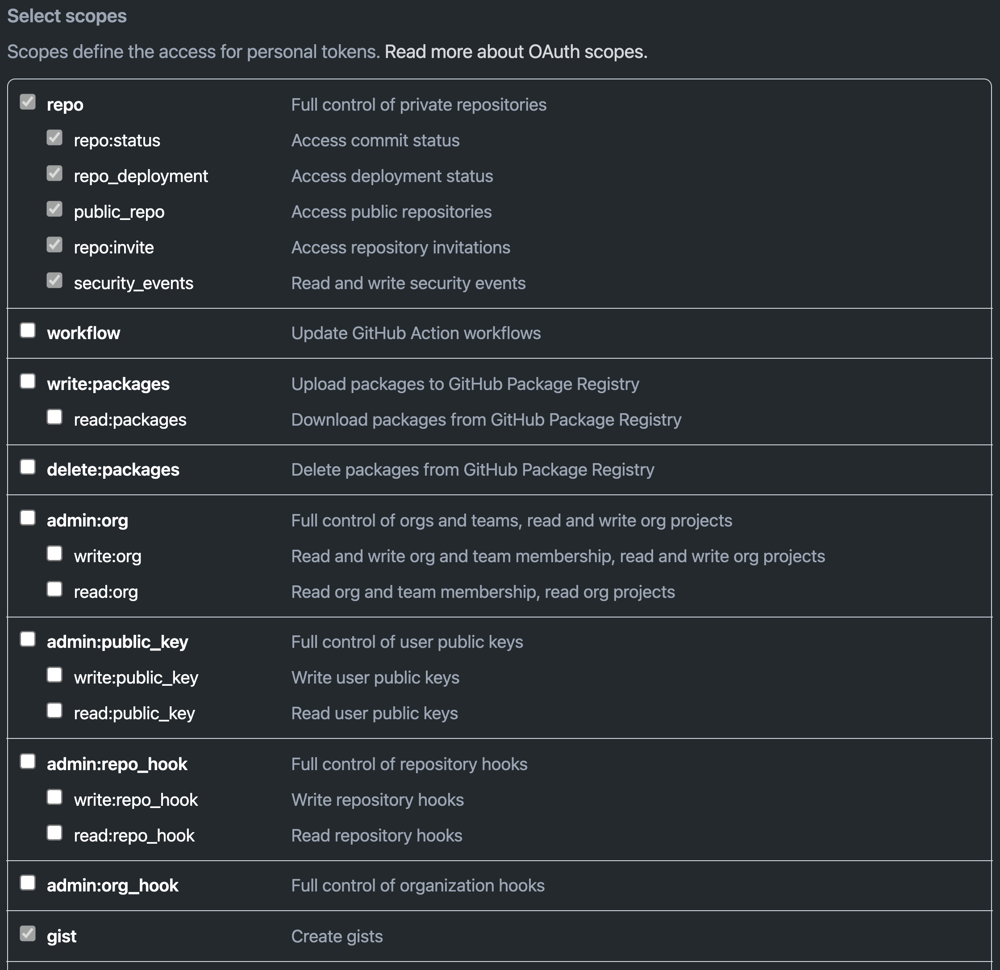

# Run CumulusCI from Github Actions

CumulusCI can be used to run continuous integration builds with GitHub
Actions. In order to follow along, you should already have a repository
that is hosted on GitHub and configured as a CumulusCI project. In other
words, we\'re assuming your project already has a `cumulusci.yml` and
that you are successfully running CumulusCI flows locally.

There is also a [template
repository](https://github.com/SFDO-Tooling/CumulusCI-CI-Demo) that is
setup to run `CumulusCI Flow`{.interpreted-text role="ref"} with GitHub
actions. This repository can be used as a starting point for
implementing your own project or as a reference for the following
material.

::: note
::: title
Note
:::

GitHub Actions are free for open source (public) repositories. Check
with GitHub about pricing for private repositories.
:::

## Create a GitHub Action Workflow

In GitHub Actions, you can define _workflows_ which run automatically in
response to events in the repository. We\'re going to create an action
called `Apex Tests` which runs whenever commits are pushed to a target
GitHub repository.

Workflows are defined using files in YAML format in the
`.github/workflows` folder within the repository. To set up the Apex
Tests workflow, use your editor to create a file named `apex_tests.yml`
in this folder and add the following contents:

```yaml
name: Apex Tests

on: [push]

env:
    CUMULUSCI_SERVICE_github: ${{ secrets.CUMULUSCI_SERVICE_github }}

jobs:
    unit_tests:
        name: "Run Apex tests"
        runs-on: ubuntu-latest
        steps:
            - uses: actions/checkout@v2
            - name: Install Salesforce CLI
              run: |
                  mkdir sfdx
                  wget -qO- https://developer.salesforce.com/media/salesforce-cli/sfdx/channels/stable/sfdx-linux-x64.tar.xz | tar xJ -C sfdx --strip-components 1
                  echo $(realpath sfdx/bin) >> $GITHUB_PATH
            - name: Authenticate Dev Hub
              run: |
                  echo ${{ secrets.SFDX_AUTH_URL }} > sfdx_auth
                  sfdx force:auth:sfdxurl:store -f sfdx_auth -d
            - name: Set up Python
              uses: actions/setup-python@v1
              with:
                  python-version: "3.8"
            - name: Install CumulusCI
              run: |
                  python -m pip install -U pip
                  pip install cumulusci
            - run: |
                  cci flow run ci_feature --org dev --delete-org
```

This workflow defines a _job_ named `Run Apex Tests` which will run
these steps in the CI environment after any commits are pushed:

1.  Check out the repository at the commit that was pushed
2.  Install the Salesforce CLI and authorize a Dev Hub user
3.  Install Python 3.8 and CumulusCI
4.  Run the `ci_feature` flow in CumulusCI in the `dev` scratch org, and
    then delete the org. The `ci_feature` flow deploys the package and
    then runs its Apex tests.

## Configure Secrets

You may have noticed that the workflow refers to a couple of
\"secrets\": `CUMULUSCI_SERVICE_github` and `SFDX_AUTH_URL`. You need to
add these secrets to the repository settings before you can use this
workflow.

To find the settings for Secrets, open your repository in GitHub. Click
the Settings tab. Then click the Secrets link on the left.

### `CUMULUSCI_SERVICE_github`

CumulusCI may need access to the GitHub API in order to do things like
look up information about dependency packages. To set this up, we\'ll
set a secret to configure the CumulusCI github service.

First, follow GitHub\'s instructions to [create a Personal Access
Token](https://help.github.com/en/github/authenticating-to-github/creating-a-personal-access-token-for-the-command-line).
Be sure to select repo and gist scope:



Now, in your repository\'s Secrets settings, click the \"Add a new
secret\" link. Enter `CUMULUSCI_SERVICE_github` as the Name of the
secret. For the Value, enter the following JSON:

```json
{ "username": "USERNAME", "password": "TOKEN", "email": "EMAIL" }
```

Click the \"Add secret\" button to save the secret.

Replace `USERNAME` with your GitHub username, `TOKEN` with the Personal
Access Token you just created, and `EMAIL` with your email address.

::: note
::: title
Note
:::

For more information on registering services in a headless environment
see the `Register Services`{.interpreted-text role="ref"} section of the
docs.
:::

### `SFDX_AUTH_URL`

CumulusCI needs to be able to access a Salesforce org with the Dev Hub
feature enabled in order to create scratch orgs. The easiest way to do
this is to set up this connection locally, then copy its SFDX auth URL
to a secret on GitHub.

Since you already have CumulusCI working locally, you should be able to
run `sfdx force:org:list` to identify the username that is configured as
the default Dev Hub username (it is marked with `(D)`).

Now run `sfdx force:org:display --verbose -u [username]`, replacing
`[username]` with your Dev Hub username. Look for the `Sfdx Auth Url`
and copy it.

::: attention
::: title
Attention
:::

Treat this URL like a password. It provides access to log in as this
user!
:::

Now in your repository\'s Secrets settings, click the \'Add a new
secret\' link. Enter `SFDX_AUTH_URL` as the Name of the secret, and the
URL from above as the Value. Click the \'Add secret\' button to save the
secret.

::: admonition
Advanced Note

These instructions connect `sfdx` to your Dev Hub using the standard
Salesforce CLI Connected App and a refresh token. It is also possible to
authenticate `sfdx` using the `force:auth:jwt:grant` command with a
custom Connected App client id and private key.
:::

Your Secrets should look like this:


## Test the Workflow

Now you should be able to try out the workflow. Commit the new
`.github/workflows/apex_tests.yml` file to the repository and push the
commit to GitHub. You should be able to watch the status of this
workflow in the repository\'s Actions tab:


If you open a pull request for a branch that includes the workflow, you
will find a section at the bottom of the pull request that shows the
results of the checks that were performed by the workflow:


It is possible to configure the repository\'s main branch as a
_protected branch_ so that changes can only be merged to it if these
checks are passing.

See GitHub\'s documentation for instructions to [configure protected
branches](https://help.github.com/en/github/administering-a-repository/configuring-protected-branches)
and [enable required status
checks](https://help.github.com/en/github/administering-a-repository/enabling-required-status-checks).

## Run Headless Browser Tests

It is possible to run Robot Framework tests that control a real browser
as long as the CI environment has the necessary software installed. For
Chrome, it must have Chrome and chromedriver. For Firefox, it must have
Firefox and geckodriver.

Fortunately GitHub Actions comes preconfigured with an image that
includes these browsers. However it is necessary to run the browser in
headless mode. When using CumulusCI\'s `robot` task, this can be done by
passing the `-o vars BROWSER:headlesschrome` option.

Here is a complete workflow to run Robot Framework tests for any commit:

```yaml
name: Robot Tests

on: [push]

env:
    CUMULUSCI_SERVICE_github: ${{ secrets.CUMULUSCI_SERVICE_github }}

jobs:
    unit_tests:
        name: "Run Robot Framework tests"
        runs-on: ubuntu-latest
        steps:
            - uses: actions/checkout@v2
            - name: Install Salesforce CLI
              run: |
                  mkdir sfdx
                  wget -qO- https://developer.salesforce.com/media/salesforce-cli/sfdx/channels/stable/sfdx-linux-x64.tar.xz | tar xJ -C sfdx --strip-components 1
                  echo $(realpath sfdx/bin) >> $GITHUB_PATH
            - name: Authenticate Dev Hub
              run: |
                  echo ${{ secrets.SFDX_AUTH_URL }} > sfdx_auth
                  sfdx force:auth:sfdxurl:store -f sfdx_auth -d
            - name: Set up Python
              uses: actions/setup-python@v1
              with:
                  python-version: "3.8"
            - name: Install CumulusCI
              run: |
                  python -m pip install -U pip
                  pip install cumulusci
            - run: |
                  cci task run robot --org dev -o vars BROWSER:headlesschrome
            - name: Store robot results
              uses: actions/upload-artifact@v1
              with:
                  name: robot
                  path: robot/CumulusCI-Test/results
            - name: Delete scratch org
              if: always()
              run: |
                  cci org scratch_delete dev
```

## Deploy to a Persistent Org

::: note
::: title
Note
:::

For instructions on setting up a connection to a persistent org in a
headless environment see the
`Register Persistent Orgs`{.interpreted-text role="ref"} section of the
docs.
:::

The final step in a CI pipeline is often deploying newly-verified
changes into a production environment. In the context of a Salesforce
project, this could mean a couple of different things. It could mean
that you want to deploy changes in a managed package project into a
packaging org. It could also mean that you want to deploy changes in a
project to a production org.

The following sections cover which tasks and flows you would want to
consider based on your project\'s particular needs.

### Deploy to a Packaging Org

When working on a managed package project, there are two standard
library flows that are generally of interest when deploying to a
packaging org: `deploy_packaging` and `ci_master`.

The `deploy_packaging` flow deploys the package\'s metadata to the
packaging org.

The `ci_master` flow includes the `deploy_packaging` flow, but also
takes care of:

1.  Updating any dependencies in the packaging org
2.  Deploying any unpackaged Metadata under `unpackaged/pre`
3.  Sets up the `System Administrator` profile with full FLS permissions
    on all objects/fields.

### Deploy to a Production Org

Deployments to a Production org environment will typically want to
utilize either the `deploy_unmanaged` flow or the `deploy` task.

In most cases, `deploy_unmanaged` will have the desired outcome. This
will deploy metadata, but also unschedule Scheduled Apex and uninstall
previously-deployed components that have been removed from the source
repository. If you do not want incremental component removal or Apex
unscheduling, use the `deploy` task.

## Build Managed Package Versions

Once new metadata has been added to the packaging org, it is often
desirable to create a new beta version for your managed package so that
it can be tested. We can use the `release_beta` flow to accomplish this.
The following shows a snippet from the [main
\<https://github.com/SFDO-Tooling/CumulusCI-CI-Demo/blob/main/.github/workflows/main.yml\>]{.title-ref}
workflow in our demo repository.

```yaml
name: Beta Package and Install

on:
    push:
        branches:
            - master
        paths-ignore:
            - "docs/**"
            - "README.md"

env:
    CUMULUSCI_SERVICE_github: ${{ secrets.CUMULUSCI_SERVICE_github }}
    CUMULUSCI_ORG_packaging: '{"username": "d.reed@cci-ci-demo.package", "instance_url": "https://cumulusci-ci-demo-dev-ed.my.salesforce.com"}'
    SFDX_CLIENT_ID: ${{ secrets.SFDX_CLIENT_ID }}
    SFDX_HUB_KEY: ${{ secrets.SFDX_HUB_KEY }}

release_beta:
    name: "Upload Managed Beta"
    runs-on: ubuntu-latest
    needs: deploy_packaging
    steps:
        - uses: actions/checkout@v2
        - name: Install Salesforce CLI
          run: |
              mkdir sfdx
              wget -qO- https://developer.salesforce.com/media/salesforce-cli/sfdx/channels/stable/sfdx-linux-x64.tar.xz | tar xJ -C sfdx --strip-components 1
              echo $(realpath sfdx/bin) >> $GITHUB_PATH
        - name: Authenticate Dev Hub
          run: |
              echo ${{ secrets.SFDX_AUTH_URL }} > sfdx_auth
              sfdx force:auth:sfdxurl:store -f sfdx_auth -d
        - name: Set up Python
          uses: actions/setup-python@v1
          with:
              python-version: "3.8"
        - name: Install CumulusCI
          run: |
              python -m pip install -U pip
              pip install cumulusci
        - run: |
              cci flow run release_beta --org packaging
```

After installing `sfdx`, Python, and CumulusCI, the workflow executes
the `release_beta` flow against the packaging org. This flow does
several things:

-   Uploads a new Beta Version of the package in the packaging org
-   Creates a GitHub release for the beta version
-   Generates sample release notes for the beta version
-   Merges the latest commit on the main branch into all open feature
    branches

::: important
::: title
Important
:::

CumulusCI is able to connect to the `packaging` org via
`CUMULUSCI_ORG_packaging` environment variable defined at the [top of
the
workflow](https://github.com/SFDO-Tooling/CumulusCI-CI-Demo/blob/404c5114dac8afd3747963d5abf63be774e61757/.github/workflows/main.yml##L11).
:::

## References

-   [GitHub Actions Documentation](https://help.github.com/en/actions)
