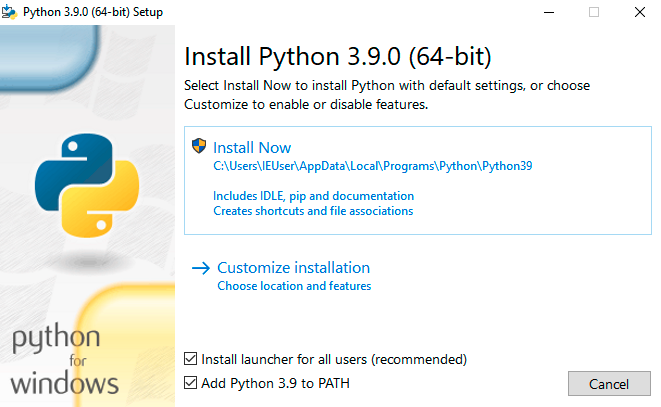

..  _`installing CumulusCI`:

--------------------
Installing CumulusCI
--------------------

macOS
^^^^^

On Mac, the easiest way to install CumulusCI is using `Homebrew <https://brew.sh/>`_.
To install homebrew:

1. Open your preferred terminal application
   (e.g. `Terminal <https://macpaw.com/how-to/use-terminal-on-mac>`_).

2. Enter::

       /bin/bash -c "$(curl -fsSL https://raw.githubusercontent.com/Homebrew/install/master/install.sh)"

3. If you are prompted for a password, this is your computer's password.
   Enter it to allow your computer to install Homebrew.

Stay in the terminal application to install CumulusCI and enter the following command::

    brew tap SFDO-Tooling/homebrew-sfdo && brew install cumulusci

When you run these commands, you'll see many lines of information while it's installing;
this will take around 4min to complete. When it's done, you'll see your command prompt
(perhaps a $ symbol) reappear.

Now `verify your installation`_.

Windows
^^^^^^^

First install Python 3:

1. Go to the `Python downloads page <https://www.python.org/downloads/windows/>`_.
2. Download the Latest Python 3 Release. The "Download Windows x86-64 executable installer" link for the most recent stable release is probably right one to use, but it may depend on your particular computer setup.
3. Use the installation wizard to install.
   *Be sure to check the “Add Python to environment variables” checkbox at the end of the install wizard*,
   otherwise you may encounter a “command not found” error with the next step.
   To access the Advanced Options area, select "Customize Installation" then click through Optional features page.

Next install pipx:

Open your preferred terminal application
(e.g. `CMD.exe <https://www.bleepingcomputer.com/tutorials/windows-command-prompt-introduction/>`_ on Windows).
If you already have your terminal open, close it and reopen it. Enter the following command::

    python -m pip install --user pipx

.. image:: images/pipx.png

To permanently modify the default environment variables:

1. Click Start and search for ‘edit environment variables’ or open System properties,
   Advanced system settings.
2. Click the Environment Variables button.
3. To change System variables, you need non-restricted access to your machine
   (i.e. Administrator rights). Add the following paths to your PATH environment variable:

   a. ``%USERPROFILE%\AppData\Roaming\Python\Python38\Scripts``
   b. ``%USERPROFILE%\.local\bin``

.. image:: images/env-var.png

Open a new command prompt and verify that pipx is available::

    pipx --version

You should see a version number after entering in this command, such as: ``0.12.3.1``.
If you get an error instead, such as ``'pipx' is not recognized as an internal or external command,
operable program or batch file.``, please check that your environment variables have been updated.

Finally, install CumulusCI: Still in your terminal application, enter the following command::

    pipx install cumulusci

Now `verify your installation`_.

Linux
^^^^^

Homebrew can also be used to install CumulusCI on Linux.
First install Homebrew using the instructions for `Homebrew on Linux <https://docs.brew.sh/Homebrew-on-Linux>`_.
Then run::

   brew tap SFDO-Tooling/homebrew-sfdo && brew install cumulusci

..  _`verify installation`:

Verify your installation
^^^^^^^^^^^^^^^^^^^^^^^^

In a new terminal window or command prompt you can verify that CumulusCI
is installed correctly by running ``cci version``:

.. code:: console

   $ cci version
    CumulusCI version: 3.9.0 (/path/to/bin/cci)
    Python version: 3.8.5 (/path/to/bin/python)

    You have the latest version of CumulusCI.

You can also use this command in the future to check whether your CumulusCI installation is up to date.

Still need help? Search issues on CumulusCI GitHub https://github.com/SFDO-Tooling/CumulusCI/issues
