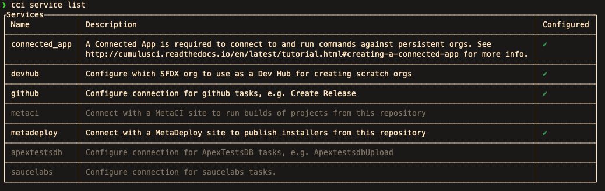

Release a Managed Package
=========================

This section outlines how to release a first generation (1GP) Salesforce Managed Package project. Salesforce.org's Release Engineering team practices `CumulusCI Flow<TODO link>`_, which incorporates all of these steps.

Prerequisites
-------------

This section assumes:

* `CumulusCI is installed <TODO: link to install>`_ on your computer.
* A Salesforce Managed Package `project has been configured <TODO: setup a project>`_ for use with CumulusCI.
* A packaging org `is connected <TODO: link to connect at persistent org>`_ to CumulusCI under the name of ``packaging``.

To verify that these things are setup you can run:

.. code-block::console

    $ cci org info packaging

Which should display information about your connected packaging org.

.. note:: 

    Your packaging org may be under a different alias.
    For a list of orgs connected to CumulusCI run ``cci org list``.

If your project has been configured for use with CumulusCI the ``cci project info`` command
should list the project's namespace under ``package__namespace`` in the output.

I Don't Have a Manged Package
^^^^^^^^^^^^^^^^^^^^^^^^^^^^^
If you have not yet created a managed package project, you will need to perform the following steps:

#. Create a Developer Edition Org (`sign up for one here <https://developer.salesforce.com/signup>`_)
#. `Create a managed package <https://developer.salesforce.com/docs/atlas.en-us.packagingGuide.meta/packagingGuide/packaging_uploading.htm>`_
#. `Assign a namespace <https://developer.salesforce.com/docs/atlas.en-us.packagingGuide.meta/packagingGuide/isv2_3_quickstart.htm>`_
#. Configure the namespace in CumulusCI 

Deploy to a Packaging Org
-------------------------

CumulusCI enables you to deploy to your ``packaging`` org with the ``ci_master`` flow.

.. warning::

    The ``ci_master`` flow runs the `uninstall_packaged_incremental<TODO>`_ task.
    This task deletes any metadata from the package in the target org not in the repository.

.. code-block:: console

    $ cci flow run ci_master --org packaging

The ``ci_master`` flow executes these tasks in the target org.

* Updates any project dependencies
* Deploys any unpackaged metadata located in the ``pre`` directory
* Deploys package metadata
* Deploys destructive changes to remove metadata in the target org that is no longer in the local workspace
* Runs the ``config_packaging`` flow, which by default, is just the `update_admin_profile task <TODO>`_.

.. tip::

    To list each step in the ``ci_master`` flow, you can run ``cci flow info ci_master``

CumulusCI separates uploading metadata to your packaging org and releasing a beta version
of your package into two flows: ``ci_master`` and ``release_beta`` respectively.
This allows for an opportunity to run checks against the org, if necessary, between deploy and release steps.

Create a Beta Version
---------------------

The ``release_beta`` flow groups the common tasks that must be executed for the release of a new beta version of a project.

.. code-block:: console

    $ cci flow run release_beta --org packaging

This flow is *always* run against the project's ``packaging`` org where it:

* Uploads a new beta version from the ``packaging`` org
* Creates a new GitHub release tag for the new beta version. This is needed if you want extension packages that also use CumulusCI to be able to find the latest version when this repository is listed as a dependency.
* `Generates Release Notes <TODO#anchor>`_
* Syncs feature branches with the ``main`` branch. This is so that feature branches have the latest changes from the default branch integrated into them. For more on on auto-merging funcitonality see `some link <TODO: link>`_

.. important::
    
    This flow assumes the package contents were already deployed using the ``ci_master`` flow.
    It *does not* include a step to deploy them.

To create a new beta version for your project without the bells and whistles, use the ``upload_beta`` task:

.. code-block:: console

    $ cci task run upload_beta --org packaging --name package_version 

Test a Beta Version
-------------------

The ``ci_beta`` flow installs the latest beta version of the project on a scratch org, and runs Apex tests against it.

.. code-block:: console

    $ cci flow run ci_beta --org <TODO>

This flow is intended to be run whenever a beta release is created.

Generate Release Notes
----------------------

The ``github_release_notes`` task fetches the text from pull requests that were merged between two given tags. The task then searches for specific titles (Critical Changes, Changes, Issues Closed, New Metadata, Installation Info, and so on) in the pull request bodies, and aggregates the text together under those titles in the GitHub tag description.

To see what the release notes look like without publishing them to GitHub:

.. code-block::

    $ cci task run github_release_notes --tag release/1.2

The ``--tag`` option aggregates text from pull requests between releases 1.2 and the next most recent release.

To see where each line in the release notes comes from, use the ``--link_pr True`` option.

.. code-block::

    $ cci task run github_release_notes --tag release/1.2 --link_pr True

To publish the release notes to a release tag in GitHub, use the ``--publish True`` option:

.. code-block::

    $ cci task run github_release_notes --tag release/1.2 --publish True

To use additional headings, add new ones (as parsers) under the ``project__git__release_notes__parsers`` section of the ``cumulusci.yml`` file.

.. code-block::

    release_notes:
        parsers:
            7: class_path: cumulusci.tasks.release_notes.parser.GithubLinesParser

.. note:: The new parser is listed with the number ``7`` because the first six are the `default parsers <https://github.com/SFDO-Tooling/CumulusCI/blob/671a0e88cef79e9aeefe1e2b835816cd8141bdbb/cumulusci/cumulusci.yml#L1154>`_ that come with CumulusCI.
        

Upload and Test a Final Version
-------------------------------

To upload a production release of your Managed Package project, use:

.. code-block::

    $ cci flow run release_production --org packaging 

Similar to ``release_beta``, this task uploads a new production version of your package, creates a release tag in GitHub, and aggregates release notes for the new version.

.. important::

    This flow assumes that the package contents have *already been deployed* using the ``ci_master`` flow.

To upload the new production version without creating the GitHub tag and generating release notes:

.. code-block::

    $ cci task run upload_beta --name v1.2.1 --production True

To test the new package version:

.. code-block::

    $ cci flow run ci_release

The ``ci_release`` flow installs the latest production release version, and runs the Apex tests from the managed package on a scratch org.

Publish an Install Plan to MetaDeploy
-------------------------------------

If are running your own instance of `MetaDeploy <https://github.com/SFDO-Tooling/MetaDeploy>`_ you can
publish a new install plan directly from CumulusCI.

You first need to setup MetaDeploy as a service:

.. code-block::console

    $ cci service connect metadeploy --url <metadeploy_url> --token <token>

You would replace ``<metadeploy_url>`` with the main url to your instance of MetaDeploy,
and ``<token>`` with a MetaDeploy API token generated from ``<metadeploy_url/admin/authtoken/token``.

You can confirm that metadeploy has been setup by running ``cci service list`` and ensuring
that the line for ``metadeploy`` has a checkmark in the "Configured" column.

You can now publish an install plan to MetaDeploy with the ``metadeploy_publish`` task.

.. code-block::console

    $ cci task run metadeploy_publish

.. tip:: 
    
    To just view the steps that this task performs 
    without publishing, use ``--dry_run True``.

.. note::

    By default, the ``--publish`` option defaults to false. This means that the plan
    needs to has the ``is_listed`` checkbox manually enabled on the plan version before
    it will be visible external users.

To publish the install plan to MetaDeploy

Manage Push Upgrades
--------------------

CumulusCI can also handle scheduling push upgrades for you with
the ``push_all`` task. 

.. warning::

    The following command will schedule push upgrades to customer's production orgs.
    Please ensure you really want to do this before executing.

.. code-block::console

    $ cci task run push_all --version <version> 

Replace ``<version>`` with the version of the managed package you want to push.
By default, push upgrades are scheduled to run immediately.
Use the ``--start_time`` option along with a time value in UTC if you want
to schedule the upgrades to occur at a specific time. Time values are
given in the following format: ``YYYY-MM-DDTHH:MM``.

.. code-block::console

    $ cci task run push_all --version <version> --start_time 2016-10-19T10:00

There are several other tasks related to push upgrades that are in the CumulusCI standard library.
These include:

* ``push_failure_report`` - Produce a CSV report of the failed and otherwise anomalous push jobs
* ``push_list`` - Schedules a push upgrade of a package versio nto all orgs listed in a specified file
* ``push_qa`` - Schedules a push upgrade of a package version to all orgs listed in ``push/orgs_qa.txt``
* ``push_sandbox`` - Schedules a push upgrade of a package version to all subscriber's sandboxes
* ``push_trial`` - Schedules a push upgrade of a package version to Trialforce Template orgs listed in ``push/orgs_trial.txt``