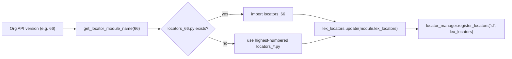

# Robot Framework Maintenance Comparison PoC Design

Status: Proposed  
Date: 2026-04-27  
Scope: Evidence-gathering PoC comparing two Robot Framework maintenance strategies for CumulusCI

## Context

CumulusCI ships a Robot Framework integration with ~37 Selenium keywords (`Salesforce.py`), a versioned locator dictionary (`locators_*.py`), a page object model, and a nascent Playwright library (`SalesforcePlaywright.py`, 8 keywords). The Selenium locators are tightly coupled to Salesforce Lightning's DOM structure, which changes every API version. Bryan's original architecture (copy-on-write locator files, `locator_manager` with dot-notation, parameterized format strings, multi-tier keyword libraries) was designed for periodic per-release maintenance. That maintenance stopped due to team capacity, not architectural failure.

Two questions now need evidence-backed answers:

1. With agent token budgets unblocked, is refreshing Selenium locators per API version a tractable ongoing cost?
2. Is porting to Playwright cheaper to maintain per release, and does it justify the migration cost?

The parent v5 roadmap requires an ADR on this topic and explicitly mandates evidence before decision.

### Shadow DOM Finding (from WIP)

API v66 has migrated parts of Lightning Experience from Aura (light DOM) to LWC (shadow DOM). Selenium 3 XPath/CSS cannot pierce shadow DOM. Affected elements include the actions ribbon on filtered list views and the List View Controls button. This is a structural ceiling for Selenium that grows with each API version as Salesforce continues the Aura-to-LWC migration.

## Goals

-   Measure agent token cost to refresh CCI's Selenium locators from API v57 to v66.
-   Measure agent token cost to port ~8 high-value Playwright keywords covering the same test surface.
-   Quantify locator durability: what fraction of Selenium locators reference Aura internals (fragile) vs. SLDS/Lightning-stable selectors?
-   Identify structural coverage ceilings (shadow DOM elements unreachable by Selenium 3).
-   Write ADR 0004 backed by the comparison evidence.
-   Draft a local "Robot Locator Refresh" skill spec codifying Bryan's best practices for agent-driven locator updates.

## Non-Goals

-   Full Playwright feature parity with `Salesforce.py` (37 keywords). Track B ports ~8.
-   Upgrading Selenium 3 to 4 (that is in the dependency-modernization phase).
-   Fixing pre-existing `[Return]` deprecation warnings or `_tkinter` import noise.
-   Refactoring the `locator_manager` or page object architecture.
-   NPSP/EDA downstream migration planning (noted in ADR as future work).
-   Resolving the `form_handlers.py` Selenium coupling for Playwright (out of scope; Track B uses Playwright-native form filling).

## Decisions

1. **Two-track comparison against the same scratch org (API v66).**  
   Track A: Selenium locator refresh. Track B: Playwright keyword port. Same test surface, same org, comparable evidence.

2. **Track A preserves Bryan's architecture.**  
   `locators_66.py` deepcopies `locators_57` and overrides only changed locators. No structural changes to `locator_manager`, `Salesforce.py`, or the versioning system.

3. **Track B uses Playwright-native locators (not `locator_manager`).**  
   `SalesforcePlaywright.py` already ignores the versioned locator system. Track B continues that pattern, using Playwright's accessibility-first selectors (`role=`, `text=`, CSS). This is a data point on whether `locator_manager` adds value for Playwright.

4. **Inline locators in page objects are in scope for Track A.**  
   `BasePageObjects.py` and `ObjectManagerPageObject.py` contain hardcoded locators outside the versioning system. Track A fixes breakage in these files too, since they are part of the real maintenance cost.

5. **ADR format follows `docs/adrs/templates/template.md`.**  
   Status starts as `Proposed`. Sections: Context and Problem Statement, Assumptions, Constraints, Decision, Considered Options, Decision Outcome, Consequences, References.

6. **Skill spec is local only.**  
   Written to `~/.cursor/skills-cursor/robot-locator-refresh/SKILL.md`, not committed to the repo.

## Current-State Inputs (WIP Baseline)

The following work was completed in a prior session before the formal loop was established. It is preserved as evidence and starting state, not reverted.

### Completed

-   Scratch org `robot-poc` created (API v66, expires ~May 4 2026).
-   `locators_66.py` created with 3 locator overrides:
    -   `actions`: added `//div[contains(@class, 'slds-page-header')]` as OR branch.
    -   `app_launcher.current_app`: broadened to `//*[contains(@class,'appName')][.//text()='{}']`.
    -   `list_view_menu.button`: added `aria-label` CSS fallback (not yet verified against shadow DOM).
-   Test file adjustments for API v66 UI changes:
    -   `TestLibraryA.py`: `breadcrumbDetail` class replaced with `//a[@role='tab'][.='{}']`.
    -   `locators.robot` line 20: `text:Mobile Publisher` changed to `text:Object Manager`.
-   86 of 88 Selenium tests pass across 10 suites.
-   `forms.robot` radiobutton test needs re-run after `list_view_menu.button` fix.

### Remaining

-   Verify `forms.robot` fix or document as shadow DOM limitation.
-   Run full 11-suite battery for final confirmation.
-   Run 4 page object suites and fix inline locator breakage.
-   Locator durability audit.
-   Skill spec draft.
-   All of Track B (Playwright port + test).
-   Comparison analysis.
-   ADR 0004.
-   Parent roadmap update.

## Architecture

### Locator Version Resolution



### Locator Inheritance Chain

```
locators_56.py  (base dict, ~87 lines, all locators)
    |
    v  deepcopy
locators_57.py  (no changes, identity copy)
    |
    v  deepcopy + 3 overrides
locators_66.py  (WIP: actions, app_launcher.current_app, list_view_menu.button)
```

Versions 58-65 all fall back to 57 via the resolver's highest-numbered fallback.

### Inline Locator Inventory (Outside Versioning System)

| File                                              | Locator Count | Risk                                         |
| ------------------------------------------------- | ------------- | -------------------------------------------- |
| `BasePageObjects.py` (`ModalMixin`)               | ~8            | `uiModal` class is Aura-internal             |
| `ObjectManagerPageObject.py`                      | 13            | Standalone dict, fully outside versioning    |
| `Salesforce.py` (modal-container, label strategy) | ~3            | Mixed Aura/SLDS                              |
| `form_handlers.py` (combobox/lookup values)       | ~2            | Lightning component selectors, moderate risk |

### Track B: SalesforcePlaywright.py

Currently 8 keywords, no connection to `lex_locators` or `locator_manager`. Hardcodes SLDS selectors inline. Track B adds ~8 keywords covering: app launcher navigation, form population, modal handling, related list interaction.

## Comparison Criteria

| Metric                          | How Measured                                                               |
| ------------------------------- | -------------------------------------------------------------------------- |
| Agent token cost                | Approximate from conversation length per track                             |
| Locator durability              | Count Aura-internal refs vs. SLDS/Lightning-stable refs in final artifacts |
| Shadow DOM ceiling              | Count elements unreachable by Selenium 3 but accessible via Playwright     |
| Per-release maintenance posture | Estimated effort to repeat locator refresh for next API version            |
| Coverage gap                    | Keywords ported vs. total `Salesforce.py` surface (37 keywords)            |
| Downstream impact               | Qualitative assessment of NPSP/EDA migration cost per path                 |

## Verification Strategy

-   **Track A Selenium battery**: 11 suites run via `uv run cci task run robot --org robot-poc -o suites <list> -o vars BROWSER:headlesschrome`
-   **Track A page objects**: 4 suites under `cumulusci/robotframework/tests/salesforce/pageobjects/`
-   **Track B Playwright**: 1 end-to-end suite via `uv run cci task run robot --org robot-poc -o suites <path> -o vars BROWSER:headlesschrome`
-   **Unit tests**: `pytest cumulusci/robotframework/tests/test_salesforce_locators.py cumulusci/robotframework/tests/test_locator_manager.py`
-   **Known noise to ignore**: `_tkinter` Dialogs import error (cosmetic), `[Return]` deprecation warnings (pre-existing)

## Risks and Mitigations

-   **Scratch org expiry (~May 4)**: all work must complete before expiry. Mitigation: org can be recreated if needed.
-   **Shadow DOM expansion**: more elements may be unreachable than currently identified. Mitigation: document all shadow DOM encounters as evidence for the ADR.
-   **Playwright `rfbrowser` installation**: requires `cci robot install_playwright`. Mitigation: already available in the dev environment.
-   **Token cost measurement is approximate**: conversation length is a proxy, not a precise metric. Mitigation: sufficient for directional comparison.

## Acceptance Criteria

-   All 11 Selenium test suites pass (or failures documented as shadow DOM limitations).
-   All 4 page object suites pass (or failures documented with root cause).
-   Locator durability audit complete with counts.
-   At least 1 Playwright end-to-end test passes against the same org.
-   ADR 0004 written with evidence from both tracks.
-   Local skill spec drafted.
-   Parent roadmap updated per closeout obligations.

## Deliverables

1. `cumulusci/robotframework/locators_66.py` (committed to repo)
2. Any keyword/page-object/test fixes (committed to repo)
3. Expanded `SalesforcePlaywright.py` with ~8 ported keywords (committed to repo)
4. 1 Playwright end-to-end `.robot` test (committed to repo)
5. `docs/adrs/0004-robot-framework-selenium-vs-playwright.md` (committed to repo)
6. `~/.cursor/skills-cursor/robot-locator-refresh/SKILL.md` (local only)
7. Parent roadmap updates (local plan file)
